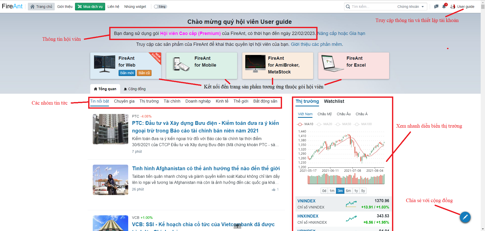

# Giao diện bên ngoài

Giao diện phía ngoài cũng là trang chủ của trang fireant.vn. Trên trang chủ bạn có thể truy cập các thông tin cũng như chức năng sau:

* Thông tin về gói hội viên của bạn và thời hạn sử dụng
* Tin tức cập nhất theo các chủ đề
* Diễn biến thị trường
* Liên kết đến các ứng dụng thuộc gói hội viên
* Tham gia giao lưu với cộng đồng các nhà đầu tư là hội viên của FireAnt
* Thiết lập hồ sơ cá nhân của bạn
* Truy vấn thông tin cổ phiếu và thông tin các thành viên thị trường (cổ đông các công ty, các hội viên) thông qua hộp tìm kiếm&#x20;

