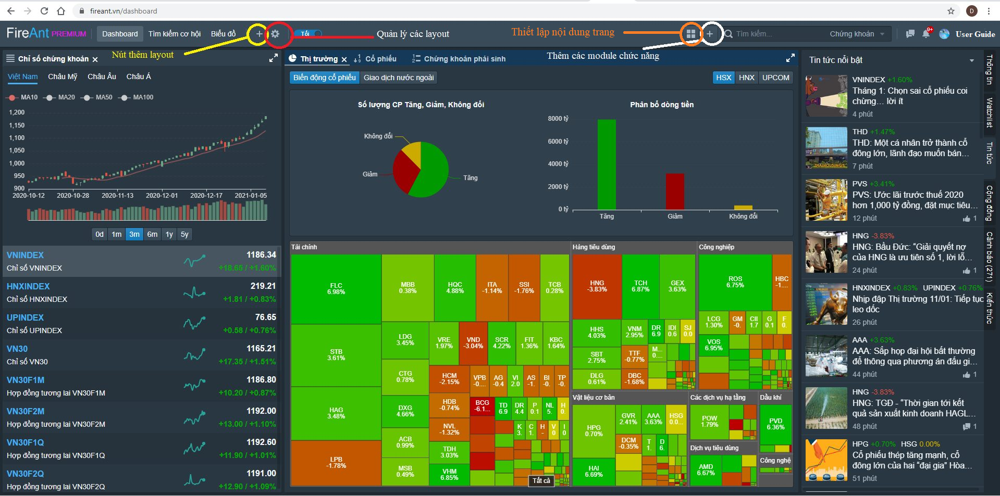
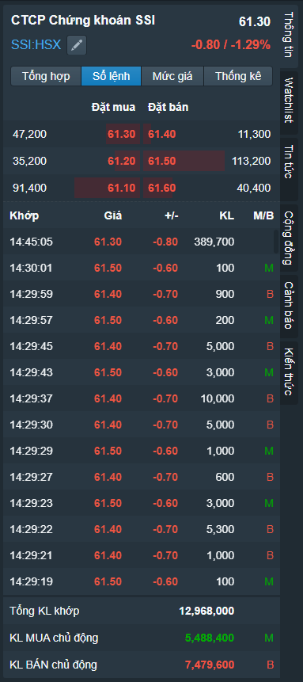
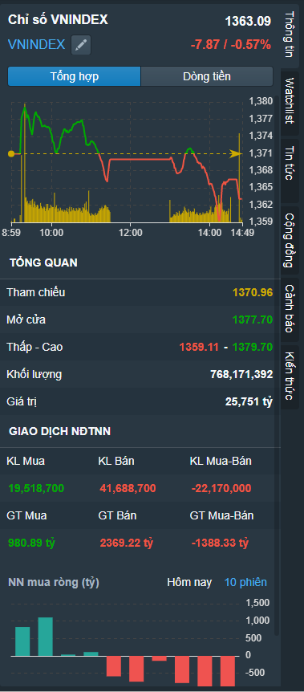
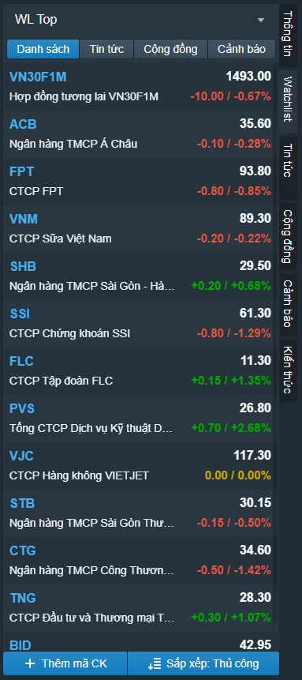
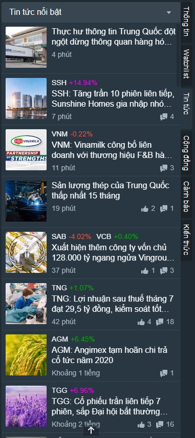
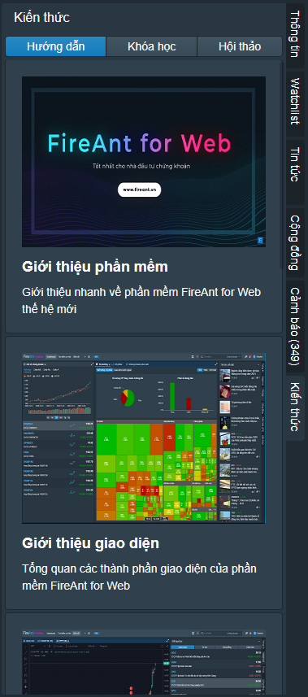

# Giao diện bên trong

Giao diện bên trong cũng là giao diện chính của FireAnt for Web, thể hiện các chức năng quan trọng nhất của ứng dụng.&#x20;

* Tất cả các chức năng đều tập trung lên một giao diện, và các chức năng có thể được sắp xếp, thêm bớt theo các trang thông tin (layout) khác nhau, tùy theo nhu cầu sử dụng.
* Thông tin giữa các nhóm chức năng được liên kết chặt chẽ, khi bạn xem thông tin 1 mã, thì không chỉ biểu đồ, mà tin tức và các thông tin khác liên quan đến mã đó cũng sẽ xuất hiện theo.
* Chức năng cộng đồng cho phép bạn tương tác nhanh chóng với những người có cùng mối quan tâm: chia sẻ thông tin (bao gồm cả biểu đồ), quan điểm một cách nhanh chóng.
* Bạn có thể xem nhiều thông tin cùng lúc: biểu đồ nhiều mã cùng lúc, biểu đồ nhiều khung giờ cùng 1 mã, biểu đồ, thống kê, tin tức, lọc ... cùng lúc, trên nhiều màn hình (tất nhiên bạn sẽ cần đầu tư thêm 1, hoặc 2 màn hình, với độ phân giải càng lớn càng tốt, nếu bạn đầu tư một cách chuyên nghiệp, thì chi phí bỏ ra sẽ là nhỏ so với lợi ích thu được) .

Mục tiêu của các nhà đầu tư có thể khác nhau, nhưng điểm chung vẫn là tìm ra mã cổ phiếu thích hợp để mua vào và bán ra khi có lợi nhuận (hoặc cắt lỗ kịp thời).&#x20;

Thông thường sẽ có 2 cách tiếp cận:

* Bạn chủ động tìm thông tin
* Thông tin tự tìm đến bạn

FireAnt for Web sẽ cung cấp cho bạn công cụ cho cả 2 cách tiếp cận này.

Ở cách tiếp cận chủ động, bạn sẽ cần đến các [công cụ lọc](https://app.gitbook.com/@fireant/s/fireant-for-web/~/drafts/-Mgz9yxkKWkxE91S8b1Y/tim-kiem-co-hoi/loc-co-phieu-thoi-gian-thuc). Ở cách tiếp cận thứ 2, các [cảnh báo thời gian thực](https://app.gitbook.com/@fireant/s/fireant-for-web/~/drafts/-Mgz9yxkKWkxE91S8b1Y/tim-kiem-co-hoi/canh-bao) dựa trên các tiêu chí mà bạn thiết lập sẽ tự động mang thông tin đến bạn.

## Thiết lập

Bạn có thể thiết lập FireAnt for Web thông qua việc

* [Tạo mới, xóa, đổi tên các trang thông tin](https://app.gitbook.com/@fireant/s/fireant-for-web/bo-cuc-layout/quan-ly-bo-cuc)
* Thêm bớt, sắp xếp các khối chức năng trong các trang thông tin
* Thiết lập nội dung cho các trang thông tin: Đặt lại bố cục mặc định cho các trang thông tin dựng sẵn đang được sử dụng, liên kết mã giữa các cửa sổ của trang thông tin có chứa biểu đồ PTKT


**Lưu ý:** Khi chọn liên kết mã, nếu bạn thay đổi mã ở một tab của một cửa sổ, hoặc chọn 1 tab khác thuộc cửa sổ đó, thì ở các tab đang được chọn ở các cửa sổ khác trên cùng trang thông tin cũng sẽ tự động chuyển sang mã mới


## Hộp tìm kiếm

Sử dụng hộp tìm kiếm cho phép bạn tìm theo:

* **Mã cổ phiếu:** kết quả tìm kiếm sẽ là truy cập tới toàn bộ thông tin về doanh nghiệp
* **Thành viên:** kết quả tìm kiếm là tuy cập tới thông tin các cổ đông cá nhân của các doanh nghiệp hoặc các hội viên FireAnt

## Các chức năng và thông tin bổ trợ

Các chức năng và thông tin bổ trợ được gắn ở menu dọc phía phải màn hình. Một số thông tin bổ trợ sẽ hiển thị khác nhau theo ngữ cảnh khác nhau, tuy vào bạn truy cập thông tin nào ở các khối chức năng trên trang thông tin.

Các chức năng và thông tin bổ trợ gồm:

* **Thông tin:** Thông tin chi tiết giao dịch trong phiên của mã cổ phiếu (giống với [thông tin tổng quan cổ phiếu](https://app.gitbook.com/@fireant/s/fireant-for-web/~/drafts/-MhI2IZ8toWKIgQeJakl/thong-tin-co-phieu/thong-tin-tong-quan)), hoặc thông tin tổng hợp thị trường, tùy theo mã chứng khoán bạn chọn là mã cổ phiếu hay index

|  |  |
| ------------------------------------------------------------------- | ------------------------------------------------------------------- |
| Thông tin giao dịch mã cổ phiếu                                     | Thông tin tổng quan chỉ số thị trường                               |

* [Watchlists](https://app.gitbook.com/@fireant/s/fireant-for-web/~/drafts/-MhI2IZ8toWKIgQeJakl/watchlists/tao-va-su-dung-watchlist): Chức năng này cho phép bạn quản lý các Watchlist của mình (tạo mới, đổi tên, xóa watchlist, thêm mã vào watchlist, xóa mã khỏi watchlist, sắp xếp mã trong watchlist). Cũng giống như các danh sách khác, các mã trong watchlist được liên kết đến thông tin mã cổ phiếu tương ứng, bạn cũng có thêm biểu đồ của mã trong watchlist vào một cửa sổ, hay gắn thành tab của một cửa sổ trong trang thông tin.

* **Tin tức**: Chức năng này cho phép bạn xem nhanh các tin tức, bình luận, like,  share. Tin tức được chia thành từng nhóm theo các lĩnh vực khác nhau:
  * **Tin tức nổi bật**: Thường là tin nóng và có sức ảnh hưởng trong ngắn hạn
  * **Nhận định chuyên gia**: Bài viết của các chuyên gia chứng khoán gửi đăng. Nội dung thể hiện quan điểm của cá nhân tác giả, không đại diện cho FireAnt.
  * **Tin thị trường**: Tin tức về diễn biến thị trường nói chung, thường là tổng hợp báo cáo của các công ty chứng khoán
  * **Tin tài chính**: Tin liên quan đến ngân hàng, tín dụng, ...
  * [**Tin Doanh nghiệp**](https://app.gitbook.com/@fireant/s/fireant-for-web/~/drafts/-MhI2IZ8toWKIgQeJakl/thong-tin-co-phieu/tin-tuc): Tin tức liên quan đến doanh nghiệp
  * **Tin kinh tế**: Tin kinh tế vĩ mô
  * **Tin thế giới**: Tin kinh tế thế giới, thường là tin về các hoạt động thương mại quốc tế, hoặc về giá hàng hóa, vàng, dầu, ...
  * **Tin Bất động sản:** Thường là tin về các dự án bất động sản
  * **Tin của cơ quan quản lý**: Tin do cơ quan quản lý (Bộ tài chính, UBCK, Sàn giao dịch, VSD) công bố

* **Cộng đồng**: Chức năng cộng đồng cho phép người dùng đăng bài viết, theo dõi người dùng khác hoặc lập các hội nhóm. Mục đích của chức năng cộng đồng là để người dùng trao đổi và chia sẻ thông tin (tin tức, biểu đồ, video, ...)
* [**Cảnh báo**](https://app.gitbook.com/@fireant/s/fireant-for-web/~/drafts/-MhIMYs9BEM80QAjVeFI/tim-kiem-co-hoi/canh-bao): Danh sách các thông báo xuất hiện khi các điều kiện của các cảnh báo được thỏa mãn. Người dùng có thể&#x20;
  * Nhắp chuột lên nội dung cảnh báo để mở biểu đồ mã tương ứng, hoặc&#x20;
  * Nhắp chuột lên mã cổ phiếu để truy cập thông tin chi tiết mã cổ phiếu, hoặc
  * Di chuột qua nội dung cảnh báo và chọn xem chi tiết để xem minh họa chi tiết cảnh báo

* **Kiến thức**: Mục này chứa&#x20;
  * Các video hướng dẫn sử dụng FireAnt for Web
  * Thông tin về các khóa học&#x20;
  * Thông tin về các cuộc hội thảo&#x20;

