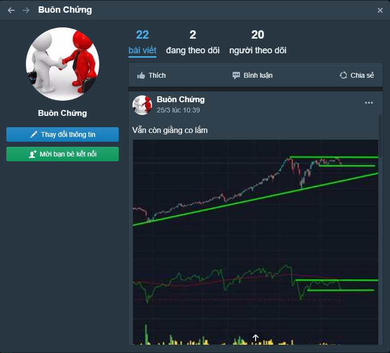
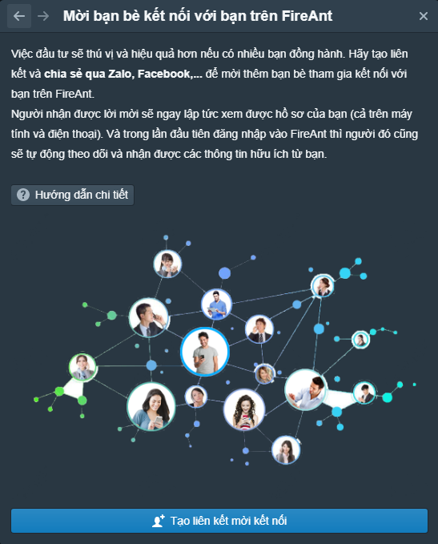
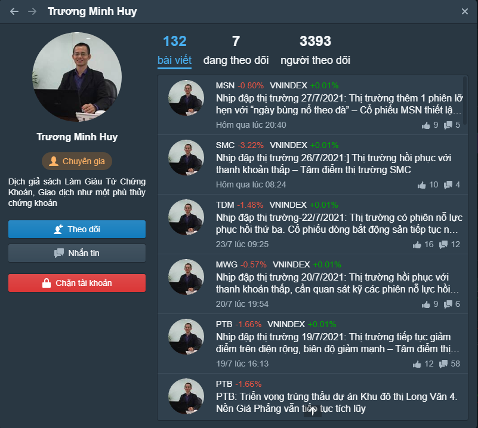
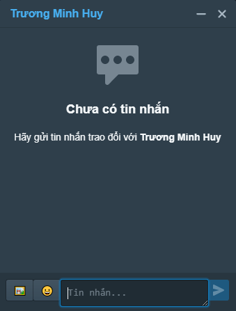
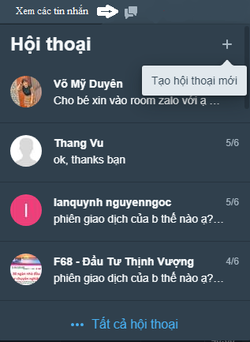

# Hồ sơ cá nhân

#### **Vào hồ sơ cá nhân của bạn**

Để xem và sửa **Hồ sơ cá nhân**, bạn cần đăng nhập, sau đó chọn mục [**Hồ sơ cá nhân**](https://www.fireant.vn/Home/Member) sau khi nhắp chuột vào **Tên** **tài khoản sử dụng** (phía trên bên phải giao diện ứng dụng).

#### **Hồ sơ cá nhân bao gồm:**

* Ảnh đại diện (avatar),
* Tên hiển thị,
* Danh sách bài viết. Bạn có thể:&#x20;
  * Xem số lượt thích, lượt chia sẻ và các bình luận của hội viên khác ở các bài viết của bạn.
  * Sửa, xóa bài viết của bạn, tham gia bình luận nội dung bài viết của bạn
* Danh sách thành viên bạn theo dõi và
* Danh sách các thành viên đang theo dõi bạn.
* [Liên kết đến chức năng thiết lập tài khoản](https://app.gitbook.com/@fireant/s/fireant-for-web/~/drafts/-MfbVswNJw-fDxsKfJod/tao-va-thiet-lap-tai-khoan-su-dung)
* Chức năng mời bạn bè kết nối: tạo liên kết và gửi vào facebook, zalo, ... những thành viên đồng ý kết nối sẽ trở thành hội viên FireAnt và tự động theo dõi bạn

#### Hồ sơ cá nhân của các hội viên khác

Khi xem hồ sơ của các hội viên khác, bạn có thể&#x20;

* Chọn theo dõi hội viên đó: Khi theo dõi hội viên khác thì bạn sẽ nhận được thông báo khi họ có bài viết hoặc bình luận mới.
* Nhắn tin cho hội viên đó: Nếu bạn muốn trao đổi một cách riêng tư với hội viên này. Lư ý là dù bạn không theo dõi hội viên khác thì khi bạn nhắn tin cho họ, hệ thống vẫn gửi thông báo cho người nhận tin, do vậy bạn cần cân nhắc khi nhắn tin, không nên làm phiền các hội viên khác.
* Chặn tài khoản của hội viên đó: Nếu bạn cảm thấy bị quấy rầy bởi hội viên này (ví dụ khi họ liên tục nhắn tin cho bạn). Khi chặn tài khoản của hội viên khác, bạn sẽ không được thông báo khi họ gửi tin nhắn cho bạn. Bạn có thể bỏ chặn sau đó để xem các tin nhắn nếu cần.
* Xem thông tin về số lượng và nội dung các bài viết của hội viên đó: bạn có thể tham gia bình luận các bài viết này, chia sẻ và chọn thích các bài viết
* Xem danh sách những người mà hội viên đó theo dõi
* Xem danh sách những người theo dõi hội viên đó
* Một số hội viên đặc biệt sẽ có dấu tích riêng: chuyên gia, hội viên tích cực, ...

#### Trao đổi tin nhắn với hội viên khác

Bạn có thể nhắn tín cho các hội viên khác, tin nhắn có thể đính kèm các biểu tượng cảm xúc hoặc chèn ảnh. Bạn có thể đồng thời trao đổi tin nhắn với nhiều người.

Bạn cũng có thể xem các tin nhắn mà các hội viên khác gửi cho bạn. Tất cả các tin nhắn sẽ được lưu trữ và bạn có thể xem lại các tin nhắn khi cần.

