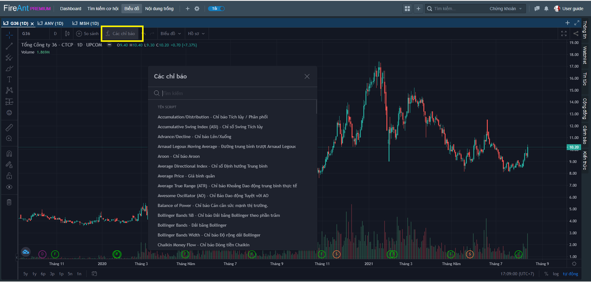
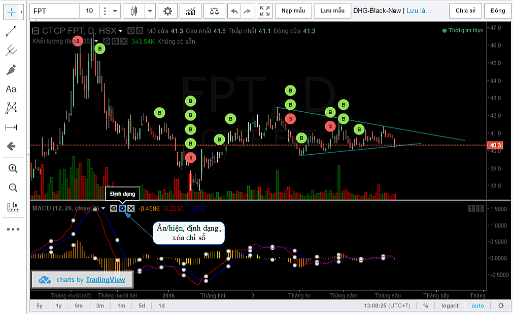
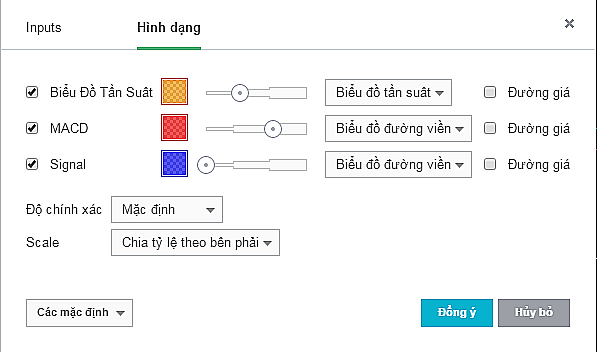

# Các chỉ báo kỹ thuật

## **Thêm chỉ số vào biểu đồ**

Để sử dụng các chỉ báo kỹ thuật, người dùng có thể chọn chức năng này trên thanh công cụ và chọn trên danh sách thực đơn (xem hình dưới).

Danh sách các chỉ số kỹ thuật sẽ được hiển thị, bạn có thể cuộn danh sách để tìm chỉ số thích hợp hoặc gõ tìm kiếm trên hộp thoại. Nhắp chuột vào chỉ số bạn thấy thích hợp, chỉ số sẽ được thêm vào biểu đồ với các thông số mặc định.

## **Thiết lập chỉ số**

Sau khi chỉ số được thêm vào biểu đồ, bạn có thể thiết lập cho chỉ số đó. Bên cạnh tên mỗi chỉ số luôn có 3 biểu tượng tương ứng:

* **Hình con mắt** – Dùng đề ẩn/hiện chỉ số
* **Hình bánh xe có răng cưa** – Dùng để thay đổi định dạng của chỉ số
* **Hình dấu X** – Dùng để xóa chỉ số khỏi biểu đồ

Tùy theo nhu cầu bạn có thể thay đổi định dạng của chỉ số bằng cách thay đổi các thông số được thiết lập cho chỉ số đó.&#x20;

