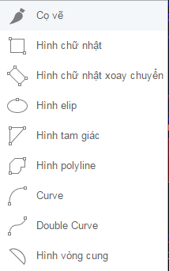
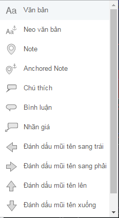
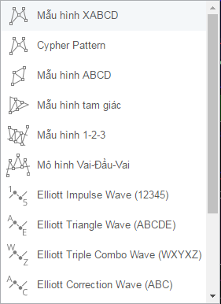
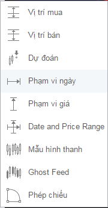
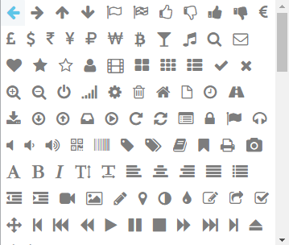

# Các công cụ vẽ

Hệ thống phân tích kỹ thuật của FireAnt cung cấp cho nhà đầu tư hơn **50 công cụ vẽ thông minh.** Các công cụ được sử dụng cho mục đích khác nhau, nhưng có chung một điểm là dễ sử dụng với các thao tác đơn giản. Sử dụng công cụ vẽ giúp biểu đồ của bạn thêm trực quan, sinh động và có khả năng tự mô tả cao.

Các công cụ vẽ được chia làm nhiều nhóm khác nhau, được mô tả dưới đây.

## **Nhóm các công cụ vẽ đường**

Các công cụ vẽ đường dùng để vẽ các đường xu hướng, góc xu hướng, kênh xu hướng, …

### **Nhóm các công cụ vẽ mô hình**

Với các công cụ vẽ mô hình người dùng có thể vẽ các mô hình PitchFork, các mô hình Gann, cũng như sử dụng hàng loạt công cụ Fibonacci để vẽ các ngưỡng giá, thời gian.

### **Nhóm công cụ vẽ hình**&#x20;

Công cụ vẽ hình giúp làm nổi bật các mẫu, các đoạn biểu đồ với các loại hình đa dạng như hình đa giác, hình ellipse, các cung cong, hoặc các hình tự do.

## **Nhóm công cụ đánh dấu/chú thích**&#x20;

Với hàng chục kiểu chú thích và đánh dấu khác nhau, bộ công cụ này giúp nhà đầu tư ghi chú các điểm nhấn bằng cách chèn các mũi tên, chú thích, bình luận, ...

## **Nhóm công cụ vẽ mẫu hình**

Bộ công cụ vẽ mẫu hình cho phép vẽ các mẫu hình từ đơn giản như ABCD, tam giác, Cipher đến phức tạp như vai đầu vai, các mô hình sóng Elliot, đường chu kỳ, vòng lặp thời gian, đường sin, ...

## **Nhóm công cụ vẽ mô phỏng/dự đoán**

Người dùng có thể sử dụng các công cụ vẽ mô phỏng/dự đoán để mô tả các dự đoán tương lai, mô phỏng diễn biến tương lai, sao chép mẫu quá khứ, đánh dấu các phạm vi giá, …

## **Nhóm biểu tượng**

Hàng trăm biểu tượng khác nhau có thể sử dụng để đánh dấu các điểm nhấn trên đồ thị, sẽ khiến đồ thị trở nên dễ hiểu và sinh động hơn.

