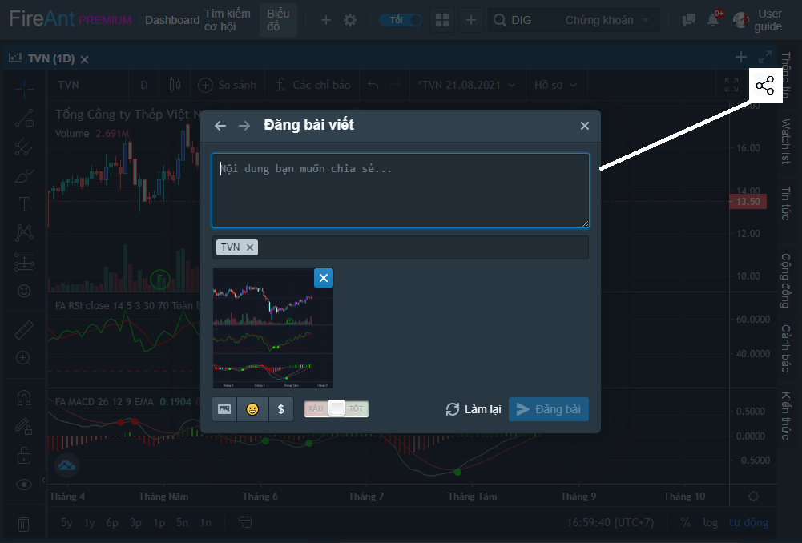
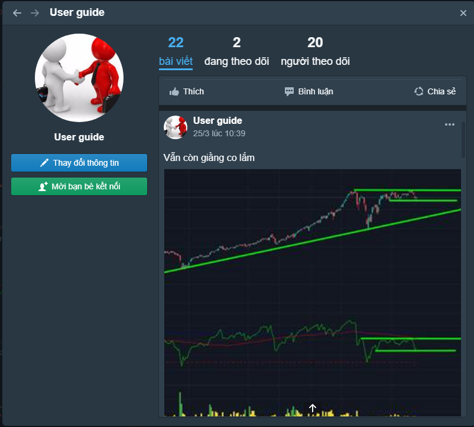

# Đăng bài viết với biểu đồ

**Đăng bài viết** là cách mà bạn **đóng góp cho cộng đồng** các nhà đầu tư. Việc chia sẻ quan điểm một cách nghiêm túc sẽ giúp các nhà đầu tư khác có thêm góc nhìn mới về mã cổ phiếu tương ứng. Sự đồng thuận của các nhà đầu khác về nhận định của bạn sẽ giúp bạn tự tin hơn. Ngay cả khi nhiều thành viên khác không tán thành quan điểm của bạn, thì sự phản biện của họ cũng sẽ giúp bạn nhận ra những điểm cần hoàn thiện.

**Đăng bài viết kèm biểu đồ trên hệ thống FireAnt vô cùng đơn giản**. Sau khi vẽ xong biểu đồ, bạn chỉ việc bấm nút chia sẻ ở góc trên bên phải màn hình, mã cổ phiếu tương ứng sẽ được tag và biểu đồ sẽ được gắn vào bài viết của bạn (dưới dạng ảnh). Bạn có thể thêm các nhận định của mình về mã cổ phiếu tương ứng, tag thêm các mã chứng khoán, tag cổ đông các công ty, chèn thêm ảnh, chèn các biểu tượng cảm xúc cũng như đánh giá xu hướng của mã chứng khoán (tích cực hay tiêu cực). Sau khi hoàn thiện bài viết, bạn bấm nút **Đăng bài**.&#x20;

Bài viết của bạn sẽ được đăng tải trên cộng đồng, và những ai đang theo dõi bạn sẽ ngay lập tức nhận được thông báo. Sau khi đăng bài, bạn có chỉnh sửa hoặc xóa bài viết, hoặc trao đổi với các hội viên khác.

