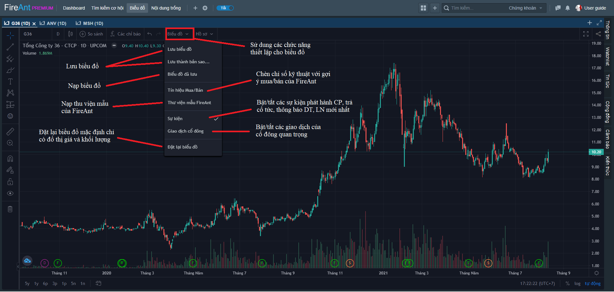
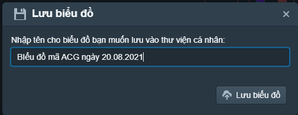
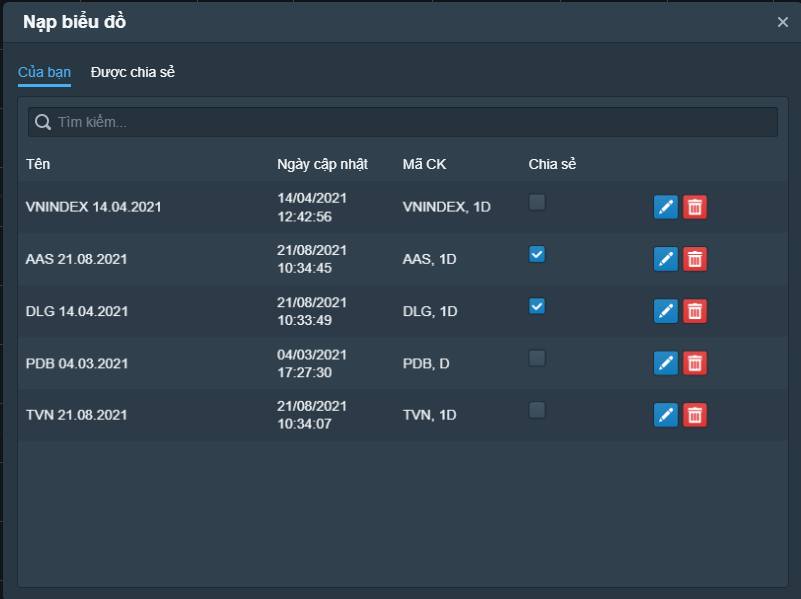

# Lưu và nạp biểu mẫu

Việc lưu và nạp mẫu biểu đồ được sử dụng cho mục đích **tái sử dụng** và **chia sẻ mẫu biểu đồ cho cộng đồng**. Mẫu biểu đồ sau khi lưu có thể nạp trở lại và/hoặc dùng cho mã cổ phiếu khác.

* Để lưu mẫu biểu đồ mới hoặc ghi đè lên mẫu biểu đồ được nạp vào, chọn nút **Biểu đồ** > **Lưu biểu đồ.** Nếu là mẫu biểu đồ mới, bạn sẽ được yêu cầu đặt tên cho mẫu biểu đồ.
* Để lưu mẫu biểu đồ dưới một tên khác, chọn nút **Biểu đồ** > **Lưu thành bản sao**, đặt tên cho mẫu biểu đồ và lưu lại.

* Để nạp mẫu biểu đồ, chọn nút **Biểu đồ** > **Biểu đồ đã lưu**, nhắp chuột vào một mẫu đã lưu.
* Bạn có thể chọn chia sẻ biểu đồ của mình cho các hội viên khác, bằng cách chọn nút chia sẻ. Các Hội viên theo dõi bạn sẽ nạp được các mẫu này.

Ngoài các mẫu biểu đồ do bạn tạo ra, bạn cũng có thể chọn các mẫu biểu đồ do các thành viên khác chia sẻ, với điều kiện bạn đang theo dõi họ.

Sau khi nạp mẫu biểu đồ của thành viên khác, bạn có thể thay đổi mẫu biểu đồ rồi lưu lại thành mẫu biểu đồ của mình.


**Lưu ý:** Các mẫu biểu đồ có thể sử dụng chung giữa FireAnt for Web và FireAnt for Mobile

