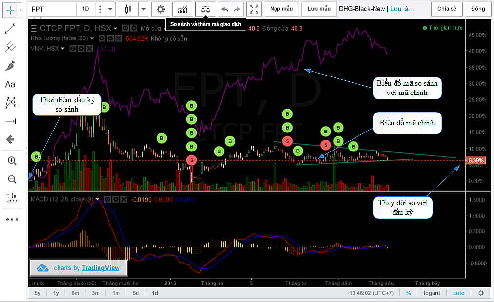

# So sánh mã cổ phiếu

Chức năng so sánh là công cụ được sử dụng để **so sánh các biến động giá** của hai hoặc nhiều mã cùng một lúc. So sánh nhiều mã đồng thời được thực hiện cho một vài lý do.

* Thông thường, có thể sử dụng việc so sánh các mã để **hình dung sức khỏe thị trường như một tổng thể**. Điều này có thể được thực hiện bằng cách so sánh các mã đại diện cho thị trường với nhau.
* Một sử dụng phổ biến khác là **so sánh hai công ty trong cùng ngành**, tuy cũng có cùng một mục đích như trên, nhưng phạm vi theo dõi sẽ thu hẹp về giới hạn 1 ngành cụ thể thay vì toàn bộ thị trường.

*So sánh các mã cổ phiếu*

Điều quan trọng là cần lưu ý rằng, khi bạn thêm một mã vào biểu đồ để thực hiện so sánh, trục tung sẽ thay đổi sang **tỷ lệ phần trăm**. Tỷ lệ phần trăm có thể hiểu là sự biến động giá cho giai đoạn hiện có thể nhìn thấy trên biểu đồ. Điều này là cần thiết, nếu bạn tắt hiển thị theo phần trăm, đặc biệt với các mã có độ chênh lớn về giá, ví dụ VHG và VNM, sẽ khiến biểu đồ của mã có giá thấp (VHG) bị trải phẳng, do đó làm mất hiệu quả của việc so sánh.&#x20;
