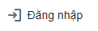
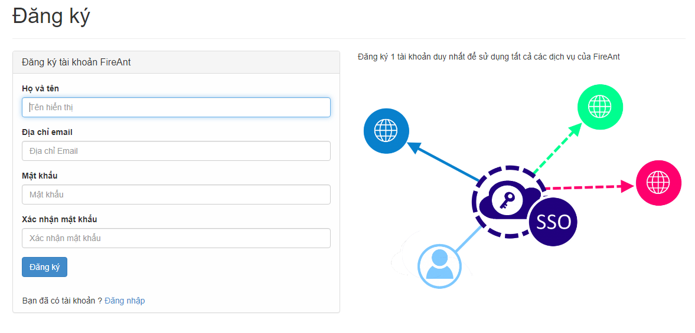

# Tạo và thiết lập tài khoản Hội viên FireAnt

#### [**Tạo tài khoản**](https://www.fireant.vn/Account/Register)

Tài khoản Hội viên FireAnt là miễn phí sử dụng cho các chức năng cơ bản, bạn chỉ cần trả phí để sử dụng các chức năng nâng cao (sử dụng các chỉ báo do FireAnt phát triển, các bộ lọc và cảnh báo nâng cao, thông tin chi tiết các sự kiện trên biểu đồ, ...)

Bạn có thể dễ dàng tạo tài khoản sử dụng với vài thao tác đơn giản:

* Vào trang <https://www.fireant.vn>, chọn nút   ở góc trên bên phải&#x20;
* Ở màn hình tiếp theo chọn đăng ký tài khoản mới và nhập Họ và tên, Địa chỉ Email, Mật khẩu (nhập 2 lần) và bấm nút đăng ký

* Nhận email, bấm vào link gửi kèm để kích hoạt là bạn đã có thể sử dụng FireAnt.
* Bạn cũng có thể sử dụng tài khoản cũ đã tạo trên **StockBiz.vn**, tài khoản **Gmail** hay tài khoản **FaceBook** để đăng nhập, tuy nhiên bạn cần lưu ý khi đăng nhập bằng tài khoản gmail hoặc facebook, mật khẩu của tài khoản gmail hoặc facebook của bạn sẽ chỉ đăng nhập được FireAnt for Web và FireAnt Mobile. Để đăng nhập FireAnt for Excel và FireAnt for Amibroker/Metastock bạn cần tạo mật khẩu riêng cho tài khoản hội viên FireAnt của bạn.

#### [**Thiết lập tài khoản**](https://www.fireant.vn/Manage)

Chức năng **Thiết lập tài khoản** cho phép bạn **thay đổi các thông tin tài khoả**n sử dụng của mình:

* Hồ sơ cá nhân: Họ tên, tiểu sử, địa chỉ
* Bảo mật:&#x20;
  * Thiết lập/thay đổi mật khẩu (sử dụng cho tất cả các ứng dụng của FireAnt).&#x20;
  * Số điện thoại  (sử dụng để khôi phục mật khẩu, hoặc đăng ký các dịch vụ của FireAnt). Số điện thoại là bắt buộc với hội viên trả phí).&#x20;
  * Xác thực 2 nhân tố (khi đăng nhập trên Website phải nhập thêm mã xác minh gửi qua ĐTDĐ hoặc Email). Lưu ý không bật xác thực bảo nhật 2 nhân tố nếu bạn không sử dụng FireAnt for Web
* Gia hạn dịch vụ
* Liên kết tài khoản giao dịch. Hiện tại có thể liên kết với tài khoản chứng khoán của bạn tại BSC hoặc với tài khoản chứng khoán ảo của FireAnt

[**Vào thiết lập tài khoản**](http://www.fireant.vn/Manage)

Để xem và sửa thông tin tài khoản bạn cần đăng nhập, sau đó chọn mục [**Thiết lập tài khoản**](http://www.fireant.vn/Manage) nhắp chuột vào **Tên tài khoản sử dụng** (phía trên bên phải màn hình ứng dụng).
