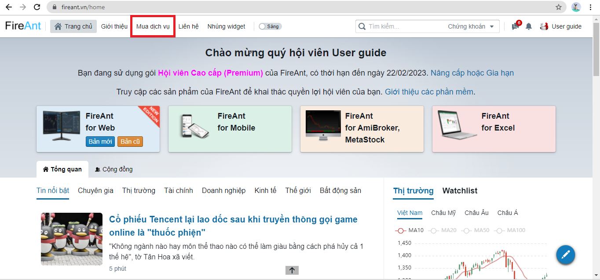
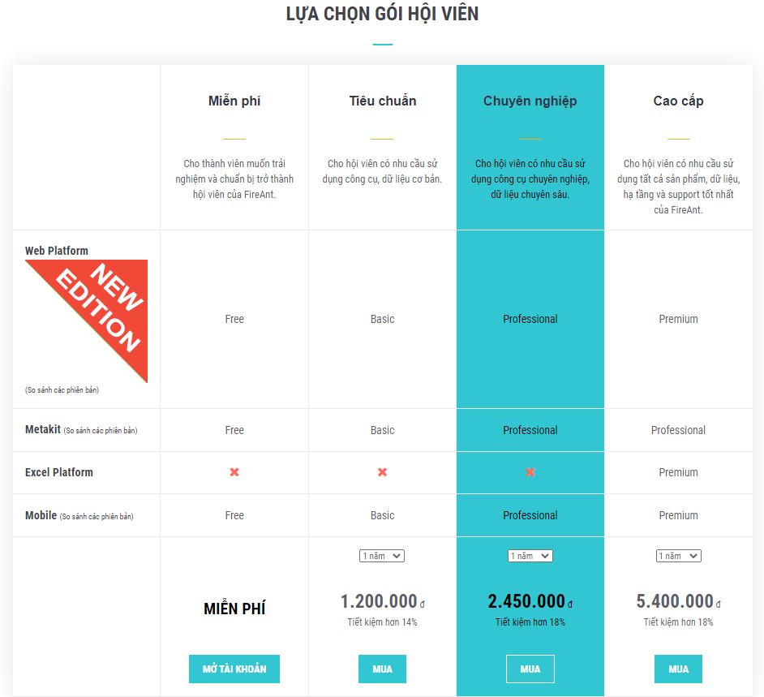
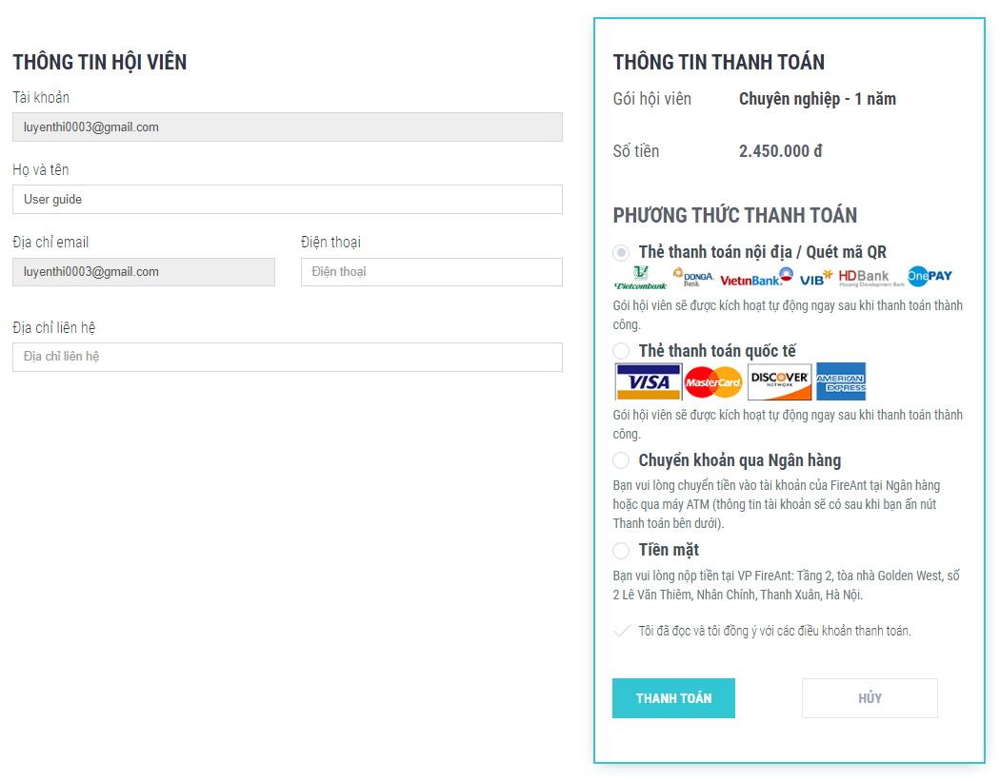
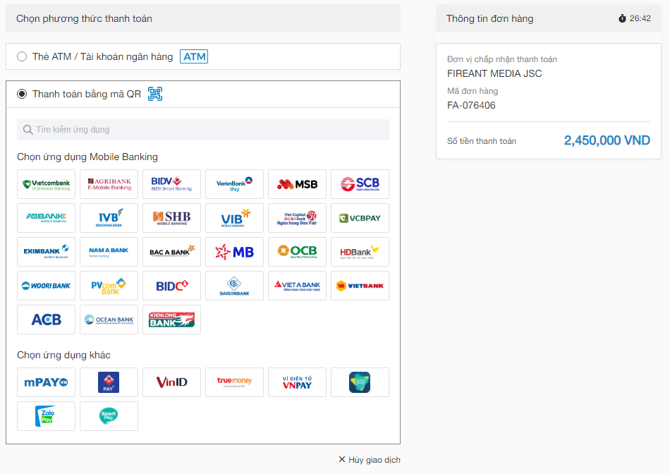
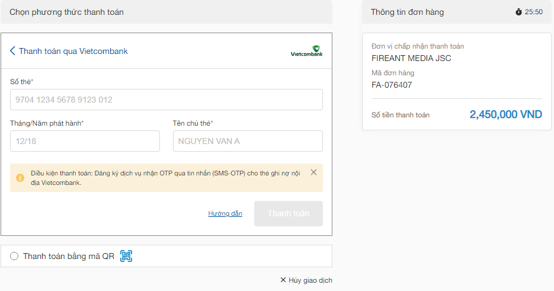
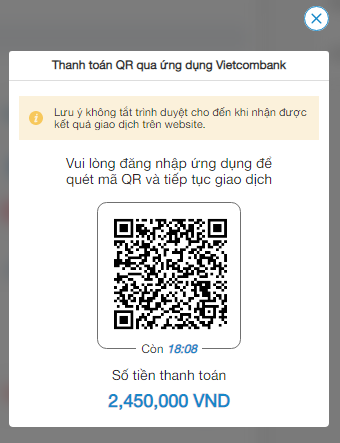
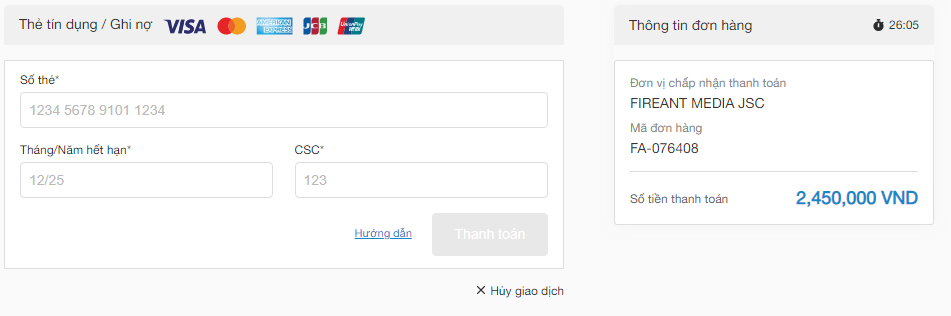
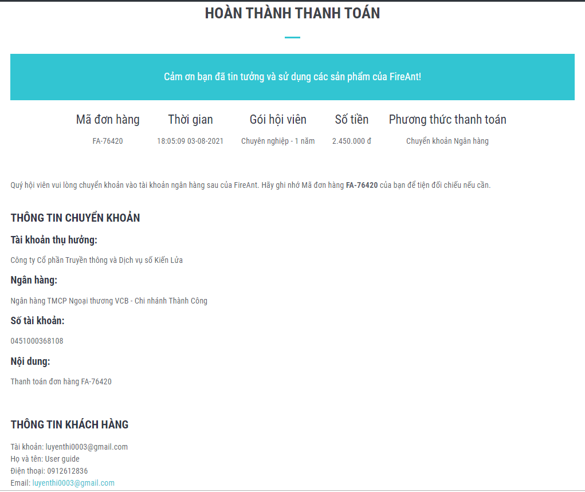
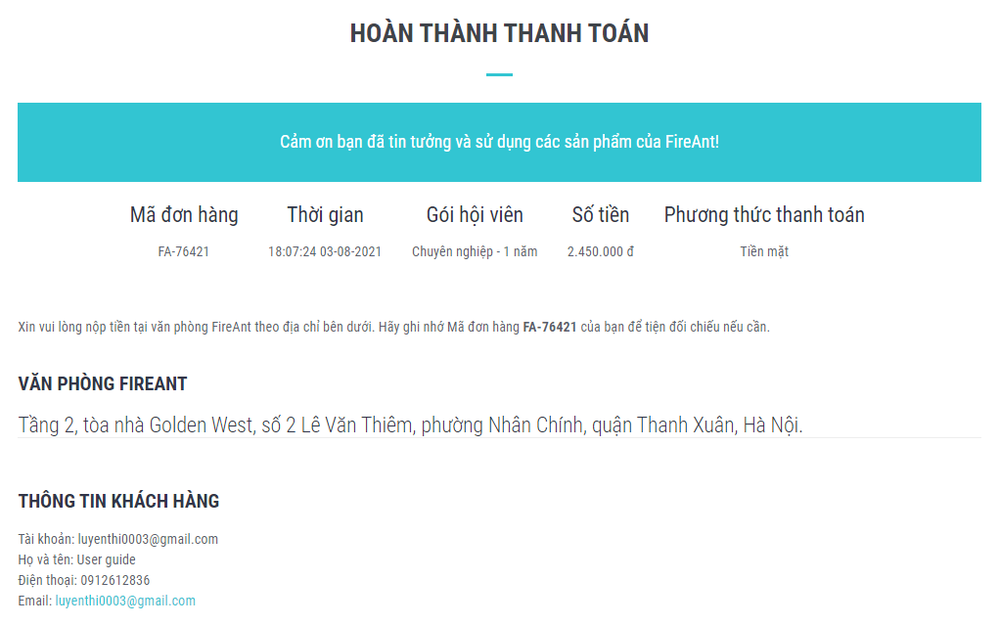

# Thanh toán phí hội viên

Hội viên FireAnt có thể sử dụng các chức năng cơ bản của **FireAnt for Web** và [FireAnt for Mobile](https://help.fireant.vn/fireant-for-mobile/) như xem biểu đồ, tham gia cộng đồng, sử dụng một số các thông kê, ... hoàn toàn miễn phí. Tuy nhiên nếu bạn cần sử dụng các công cụ nâng cao như các bộ lọc, cảnh báo với các tiêu chí đa dạng hơn, xem nhanh các sự kiện ngay trên biểu đồ, hay chèn các chỉ báo do FireAnt phát triển lên biểu đồ ..., cũng như bạn muốn sử dụng thêm các công cụ như [FireAnt for Amibroker](https://help.fireant.vn/fireant-for-metakit), hay [FireAnt for Excel](https://help.fireant.vn/fireant-for-excel), bạn sẽ cần nâng cấp tài khoản lên các phiên bản trả phí.

## Các bước thanh toán gói hội viên

Để thanh toán phí hội viên, bạn vào trang <https://www.fireant.vn>, đăng nhập, và chọn nút [Mua dịch vụ](https://corporate.fireant.vn/Members) phía trên, bên phải.

Ở màn hình tiếp theo, bạn chọn gói hội viên, thời hạn sử dụng và bấm nút **Mua**

Tiếp theo bạn sẽ được yêu cầu kiểm tra lại thông tin tài khoản của mình, chọn phương thức thanh toán, chọn **Tôi đã đọc và đồng ý với các điều khoản thanh toán**, và bấm nút **Thanh toán**

## Phương thức thanh toán

Tùy thuộc vào việc bạn chọn phương thức thanh toán nào, bước tiếp theo hệ thống sẽ cung cấp cho bạn các thông tin thanh toán tương ứng.

Có 4 phương thức thanh toán

* [Thanh toán bằng thẻ nội địa / quét mã QR](/fireant-for-web/thanh-toan-phi-hoi-vien.md#thanh-toan-bang-the-noi-dia-quet-ma-qr)
* [Thanh toán bằng thẻ thanh toán quốc tế](/fireant-for-web/thanh-toan-phi-hoi-vien.md#thanh-toan-bang-the-noi-dia-quet-ma-qr)
* [Thanh toán bằng hình thức chuyển khoản qua ngân hàng](/fireant-for-web/thanh-toan-phi-hoi-vien.md#thanh-toan-bang-the-thanh-toan-quoc-te)
* [Thanh toán bằng tiền mặt tại công ty](/fireant-for-web/thanh-toan-phi-hoi-vien.md#thanh-toan-bang-tien-mat)

### Thanh toán bằng thẻ nội địa / Quét mã QR

Khi chọn phương thức thanh toán bằng thẻ nội địa hoặc quét mã QR, hệ thống sẽ yêu cầu bạn chọn ngân hàng bạn mở tài khoản.

Nếu phương thức thanh toán của bạn là thẻ nội địa, bạn sẽ được yêu cầu nhập số thẻ, năm phát hành và tên chủ thẻ để thực hiện thanh toán.

Nếu phương thức thức thanh toán của bạn là quét mã QR, hệ thống sẽ hiện mã QR, bạn hãy dùng chức năng quét mã QR trên ứng dụng ngân hàng của bạn để quét mã và thực hiện tahnh toán.

### Thanh toán bằng thẻ thanh toán quốc tế

Khi chọn phương thức thanh toán là thẻ thanh toán quốc tế, hệ thống sẽ yêu cầu bạn nhập số thẻ, thời điểm hết hạn thẻ và mã CSC (gồm 4 chữ số với American express và 3 chữ số với các thẻ khác). Bạn có thể bấm vào liên kết hướng dẫn để xem hướng dẫn chi tiết.

Lưu ý: Nếu thẻ thanh toán quốc tế của bạn được phát hành bởi ngân hàng nước ngoài (kể cả ngân hàng nước ngoài tại Việt Nam), xin liên hệ trước với FireAnt để chúng tôi hỗ trợ bạn đăng ký số thẻ với nhà cung cấp dịch vụ thanh toán.&#x20;

### Thanh toán bằng chuyển khoản

Khi chọn phương thức thanh toán là chuyển khoản qua ngân hàng, hệ thống sẽ tạo thông tin thanh toán, gồm tài khoản thụ hưởng của FireAnt, và nội dung chuyển tiền. Bạn chuyển khoản theo các thông tin được hướng dẫn.&#x20;

### Thanh toán bằng tiền mặt

Khi chọn phương thức thanh toán bằng tiền mặt, hệ thống sẽ tạo thông tin thanh toán, bạn có thể in hoặc chép lại thông tin này để đối chiếu khi đến thanh toán tại trụ sở công ty.

