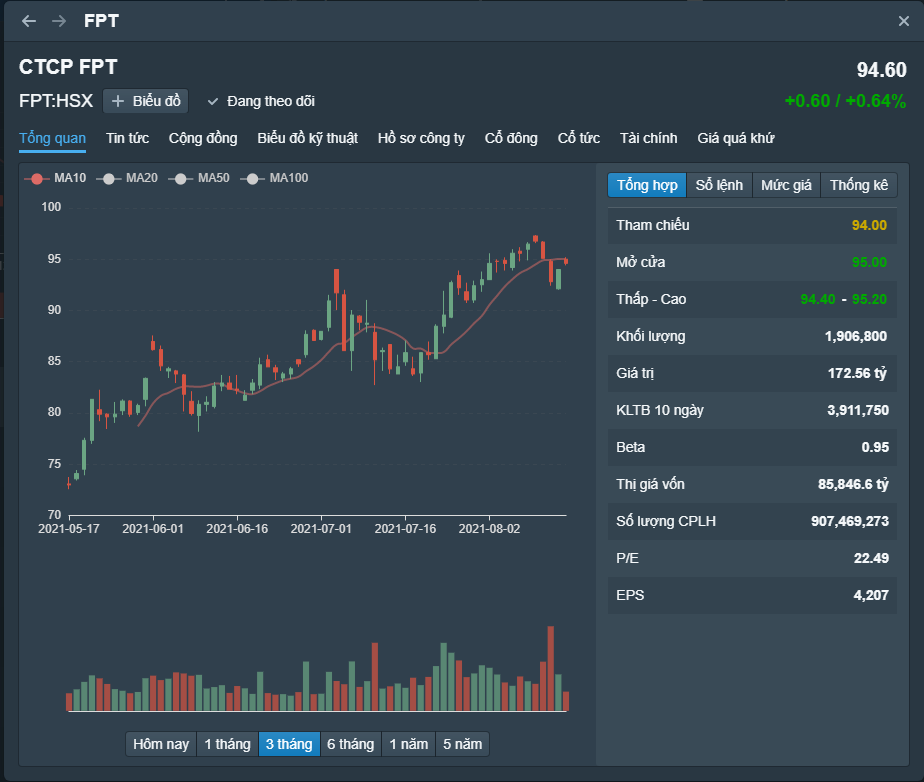
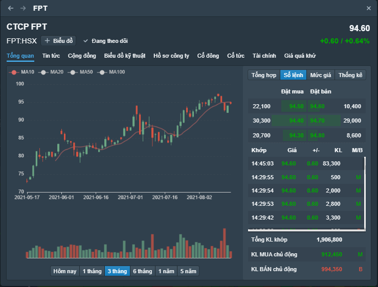
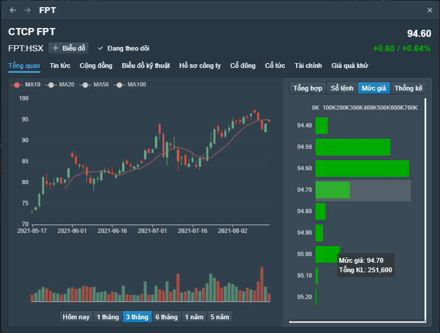
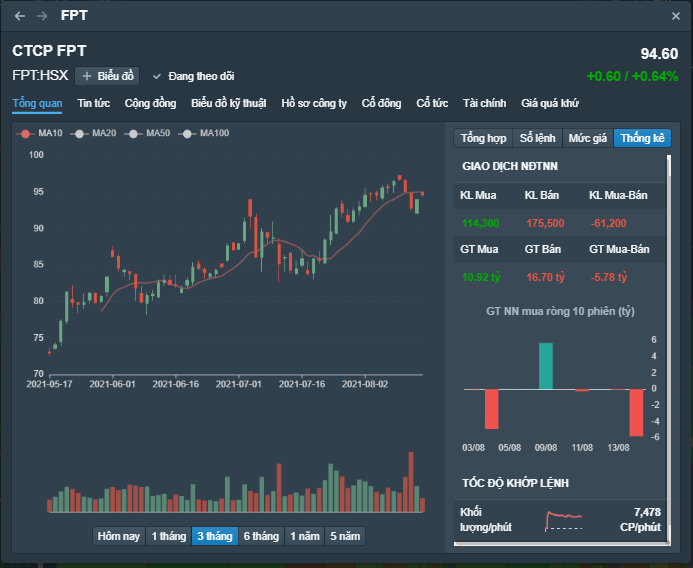

# Thông tin tổng quan

Thông tin tổng quan cung cấp cái nhìn khái quát về mã cổ phiếu. Người dùng có thể nhanh chóng tiếp cận các thông tin sau:

* **Đồ thị diễn biến giá** trong các khoảng thời gian 5 năm, 1 năm, 6 tháng, 3 tháng, 1 tháng và phiên hiện tại
* **Thông tin tổng hợp**: Các mức giá OHLC, KLGD, KLGD TB 10 phiên, Thị giá vốn, số CP lưu hành, P/E, EPS, Beta

* **Sổ lệnh**: Các lượt khớp lệnh trong phiên, khối lượng mua bán chủ động, khối lượng đặt mua đặt bán

* **KLGD ở các mức giá** trong phiên

* **Thống kê giao dịch** nhà đầu tư nước ngoài và tốc độ khớp lệnh

