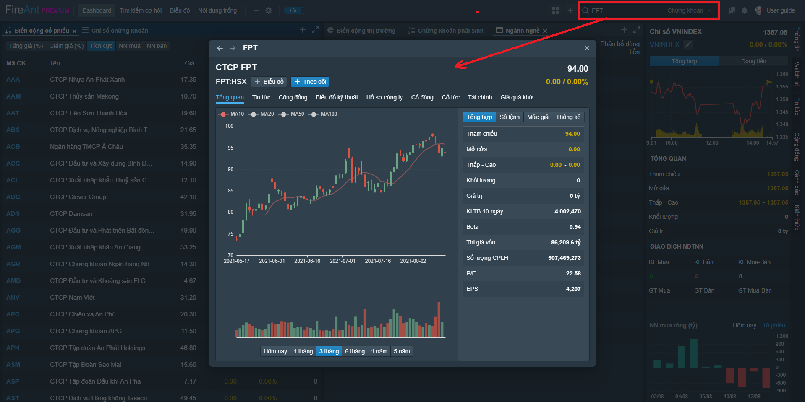

# Truy cập thông tin cổ phiếu

Để truy cập thống tin mã cổ phiếu, bạn có thể nhắp chuột vào mã cổ phiếu trong bất cứ danh sách nào, trên bảng giá, watchlists, hay danh sách kết quả tìm kiếm, thông tin cảnh báo, tin tức, ...

Bạn cũng có thể truy cập thông tin cổ phiếu qua cách truy cập truyền thống thông qua hộp tìm kiếm trên thanh công cụ.

Thông tin cổ phiếu bao gồm các nhóm thông tin sau:

* Thông tin tổng quan
* Tin tức
* Bài viết chia sẻ trên cộng đồng
* Biểu đồ phân tích kỹ thuật
* Hồ sơ công ty
* Thông tin Cổ đông chính
* Thông tin cổ tức
* Thông tin tài chính
* Dữ liệu giá quá khứ
