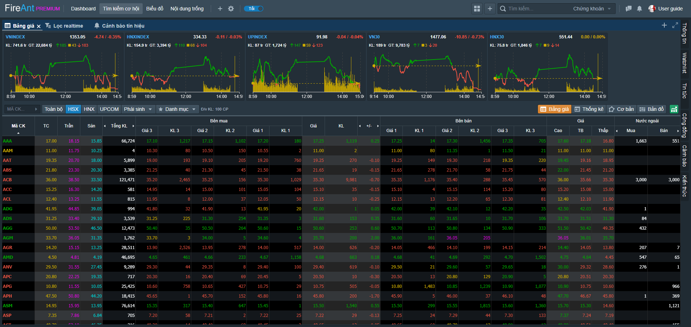
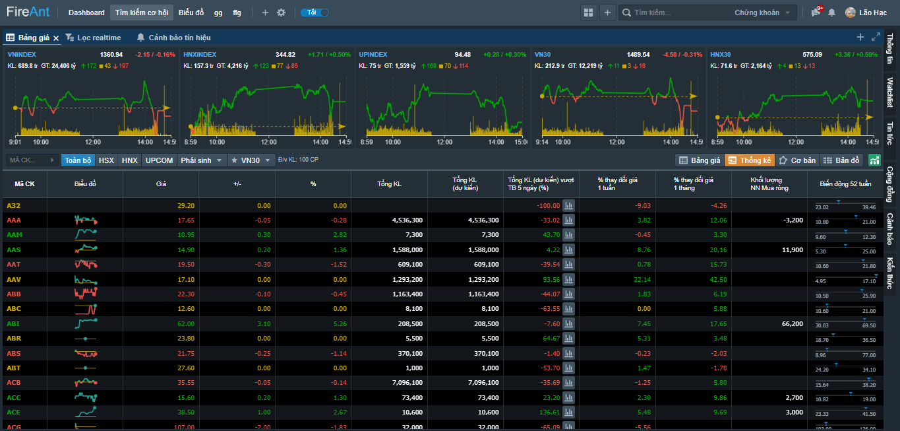
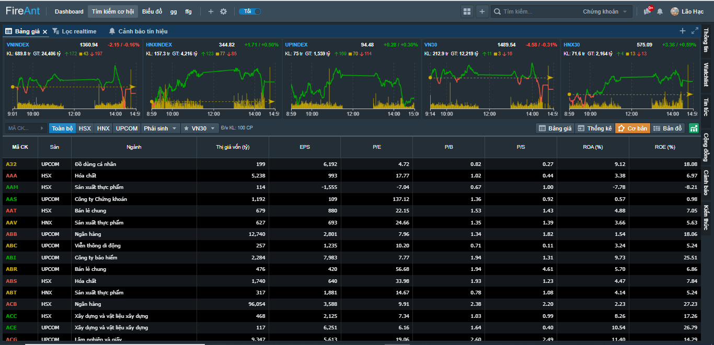
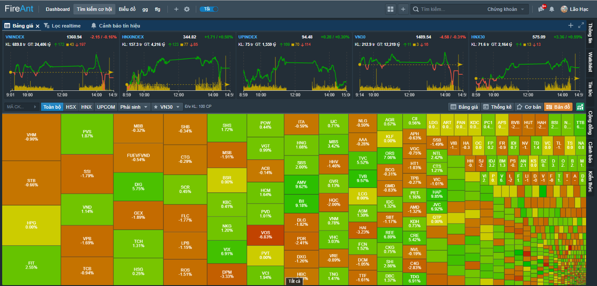

# Bảng giá

Bảng giá được thiết kế để giúp bạn có **nhiều góc nhìn** vào diễn biến của thị trường, qua đó nắm bắt thị trường tốt hơn. Dữ liệu trên bảng giá được cập nhật theo thời gian thực.

## Bảng giá truyền thống

Bảng giá truyền thống là bảng giá chứa các cột dữ liệu liên quan trực tiếp đến giao dịch, bao gồm:

* Mã chứng khoán
* Các mức giá: trần, sàn, tham chiếu, giá khớp hiện tại, giá cao nhất, thấp nhất, giá trung bình
* Khối lượng khớp gần nhất, tổng khối lượng khớp
* Các mức giá đặt mua, đặt bán
* Thay đổi giá theo giá trị và theo phần trăm so với giá tham chiếu
* Khối lượng mua bán của khối ngoại, room ngoại còn lại
* Khối lượng dư mua, dư bán

Người dùng có thể chọn xem các bảng giá truyền thống khác nhau:

* **Bảng giá toàn bộ:** tổng hợp tất cả các mã của 3 sàn
* Bảng giá theo sàn: với các mã phân theo sàn (HSX, HNX, UPCOM),&#x20;
* Các bảng giá phái sinh: Bảng giá các mã hợp đồng tương lai chỉ số VN30 và bảng giá các mã chứng quyền
* Bảng giá theo danh sách mặc định: gồm các bảng giá với các mã của VN30 và HNX30
* Bảng giá theo [Watchlist](https://help.fireant.vn/fireant-for-web/watchlists/vai-tro-cua-watchlist): Gồm các mã trong một Watchlist. Bên cạnh đó người dùng còn có thể tạo thêm [Watchlist ](https://help.fireant.vn/fireant-for-web/watchlists/vai-tro-cua-watchlist)và sử dụng như một bảng giá mới.

## Các bảng thông tin nâng cao

Bên cạnh các bảng giá truyền thống, người dùng có thể xem thêm các bảng thông tin nâng cao, bao gồm:

* Bảng thống kê giao dịch
* Bảng chỉ số tài chính cơ bản
* Bản đồ nhiệt

#### Bảng giá thống kê giao dịch

#### Bảng chỉ số tài chính cơ bản

#### Bản đồ nhiệt

