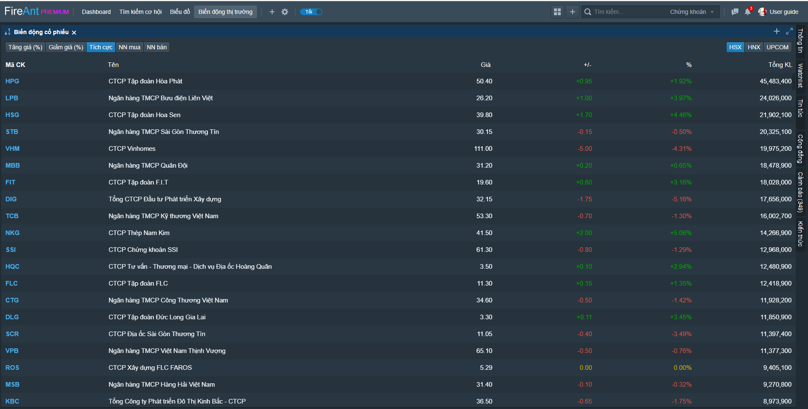

# Biến động cổ phiếu

Chức năng biến động cổ phiếu cung cấp các thống kê về giao dịch của các mã cổ phiếu. Các mã cổ phiếu sẽ được sắp xếp theo các tiêu chí khác nhau, và được phân loại theo sàn giao dịch:

* Sắp xếp theo phần trăm tăng giá
* Sắp xếp theo phần trăm giảm giá
* Sắp xếp theo khối lượng giao dịch cao nhất
* Sắp xếp theo giá trị mua ròng cao nhất của nhà đầu tư nước ngoài
* Sắp xếp theo giá trị bán ròng cao nhất của nhà đầu tư nước ngoài

