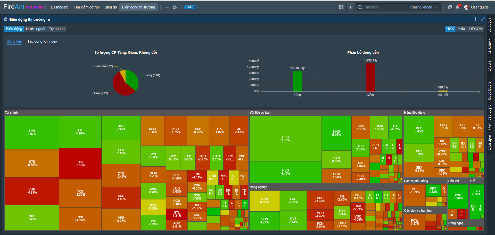
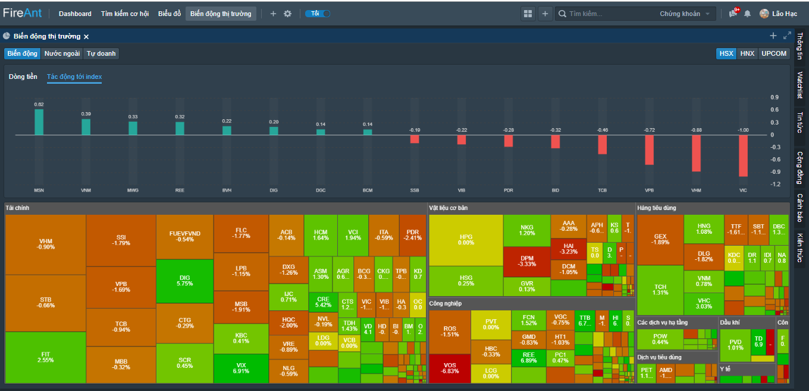
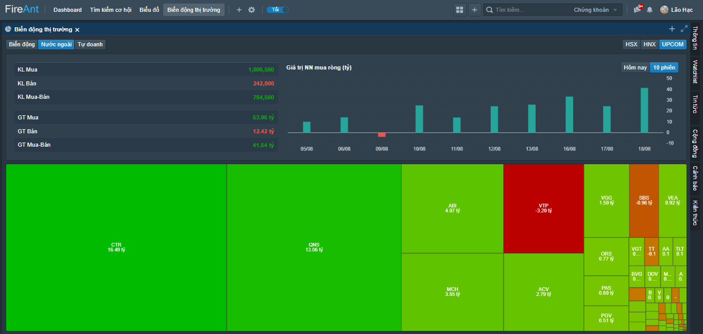
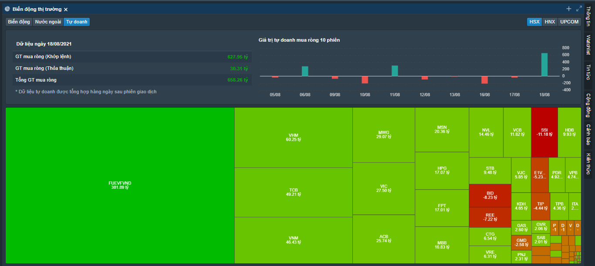

# Biến động thị trường

Chức năng **Biến động thị trường** cho phép theo dõi nhanh và trực quan đường đi của dòng tiền dựa trên các thống kê, được phân theo sàn giao dịch

* **Dòng tiền**
  * Số lượng mã tăng giảm và không thay đổi giá
  * Phân bổ dòng tiền vào các mã tăng, giảm và không thay đổi giá

* **Tác động đến Index:** Các mã có tác động nhiều nhất đến index theo cả 2 chiều hướng tích cực và tiêu cực

* **Giao dịch của khối ngoại:** Thể hiện thống kê giao dịch của khối ngoại
  * Khối lượng mua, bán của khối ngoại
  * Giá trị mua, bán của khối ngoại
  * Biểu đồ mua bán ròng của khối ngoại trong phiên và 10 phiên cuối

* **Giao dịch của tự doanh:** Thể hiện thống kê giao dịch của tự doanh các công ty chứng khoán (hiện dữ liệu tự doanh chỉ có cho các mã của sàn HSX)
  * Giá trị mua, bán ròng của tự doanh (khớp lệnh và thỏa thuận)
  * Biểu đồ mua bán ròng của tự doanh trong 10 phiên cuối

* **Bản đồ nhiệt**: Tương ứng mỗi loại thống kê, bản đồ nhiệt sẽ có thể hiện khác nhau
  * **Biến động thị trường**: Bản đồ nhiệt thể hiện mức độ hút dòng tiền của các mã một cách trực qua thông qua màu sắc và diện tích mã đó chiếm trên bản đồ nhiệt
  * **Giao dịch nhà đầu tư nước ngoài**: Bản đồ nhiệt thể hiện mức độ hút dòng tiền của khối ngoại vào các mã một cách trực qua thông qua màu sắc và diện tích mã đó chiếm trên bản đồ nhiệt
  * **Giao dịch tự doanh**: Bản đồ nhiệt thể hiện mức độ hút dòng tiền của tự doanh các công ty chứng khoán vào các mã một cách trực qua thông qua màu sắc và diện tích mã đó chiếm trên bản đồ nhiệt
