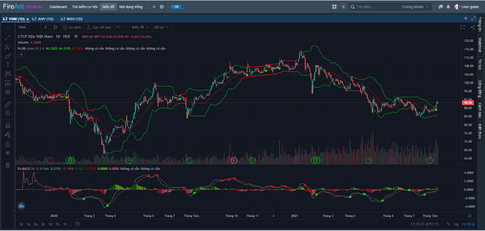
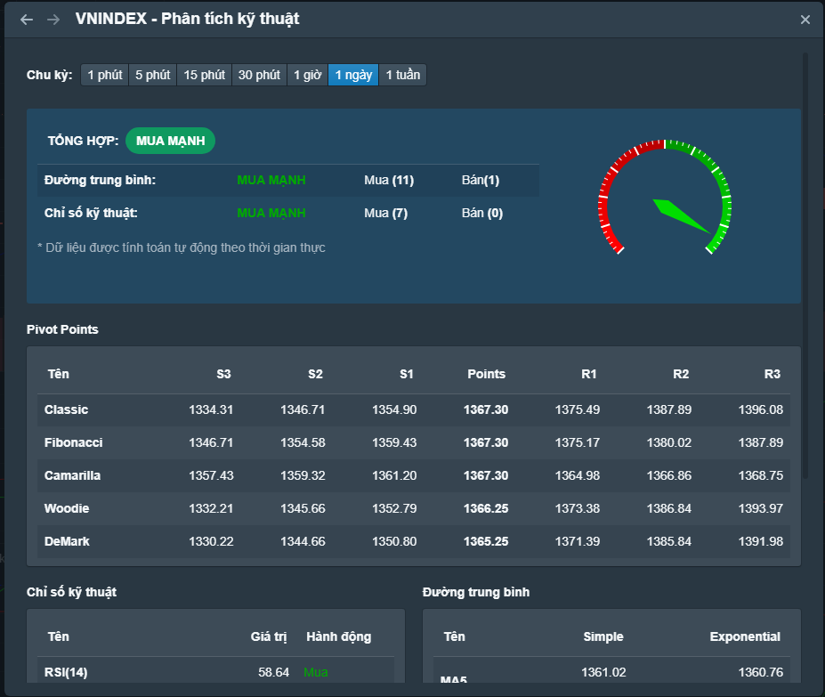
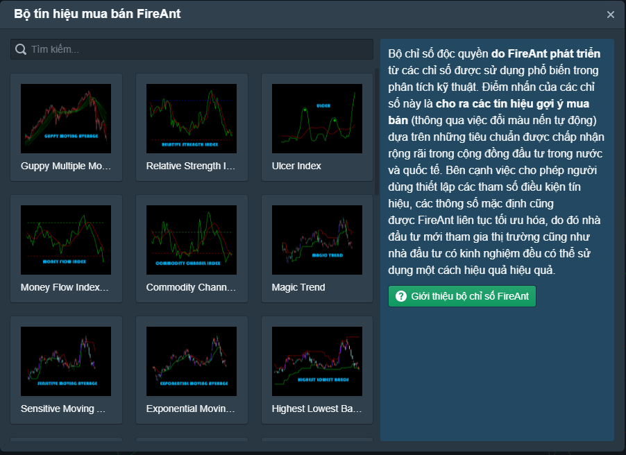
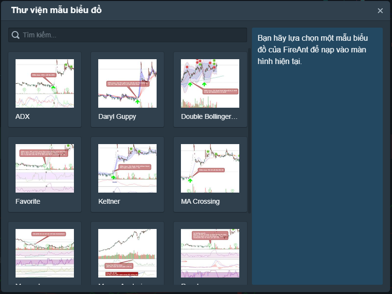

# Biểu đồ kỹ thuật

[Biểu đồ kỹ thuật ](https://help.fireant.vn/fireant-for-web/phan-tich-ky-thuat/gioi-thieu-he-thong-phan-tich-ky-thuat)hiển thị diễn biến giao dịch của các mã chứng khoán, gồm biểu đồ giá, khối lượng. Người dùng có thể sử dụng nhiều công cụ vẽ để phân tích xu hướng, mẫu hình, ... và chèn các chỉ số kỹ thuật cũng như cơ bản lên biểu đồ.

Hệ thống của FireAnt cho phép[ lưu biểu đồ](https://help.fireant.vn/fireant-for-web/phan-tich-ky-thuat/luu-va-nap-bieu-mau) để tái sử dụng (có thể nạp vào trên máy tính khác hoặc mobile). Hệ thống cũng cho phép **chia sẻ mẫu biểu đồ** với các hội viên khác. Các hội viên theo dõi bạn đều có thể nạp các mẫu biểu đồ mà bạn chia sẻ, chỉnh sửa rồi lưu lại thành mẫu riêng của họ.

Bạn cũng có thể [chia sẻ quan điểm](https://help.fireant.vn/fireant-for-web/phan-tich-ky-thuat/chia-se-bieu-do) với các hội viên khác. Mặc dù bạn có thể tạo bài viết để chia sẻ thông tin với cộng đồng từ nhiều vị trí khác nhau trên FireAnt for Web, nhưng khi tạo bài viết chia sẻ từ biểu đồ, sẽ có sự khác biệt là biểu đồ sẽ tự động được đưa vào bài viết của bạn dưới dạng ảnh, và mã chứng khoán tương ứng với biểu đồ cũng được tag tự động vào bài viết.

Người dùng cũng có thể sử dụng hệ thống tổng hợp các chỉ số kỹ thuật để nắm được trạng thái hiện tại của các cổ phiếu.

FireAnt cũng cung cấp sẵn một số chỉ báo kỹ thuật nâng cao với các tín hiệu gợi ý mua/bán, giúp nhà đầu tư nhanh chóng phát hiện các cơ hội tham gia thị trường.

Một số thư viện biểu đồ mẫu với các nhóm chỉ số được chèn sẵn giúp người dùng mới dễ dàng hơn trong việc chọn lựa và làm quen với các chỉ số kỹ thuật.

