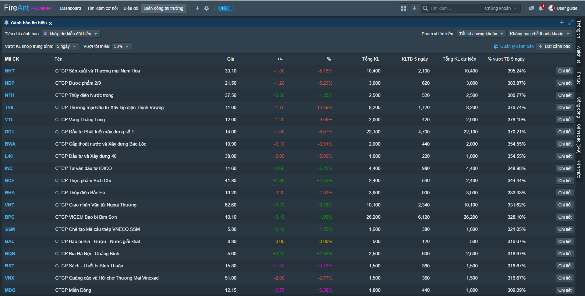
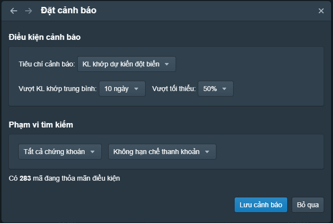
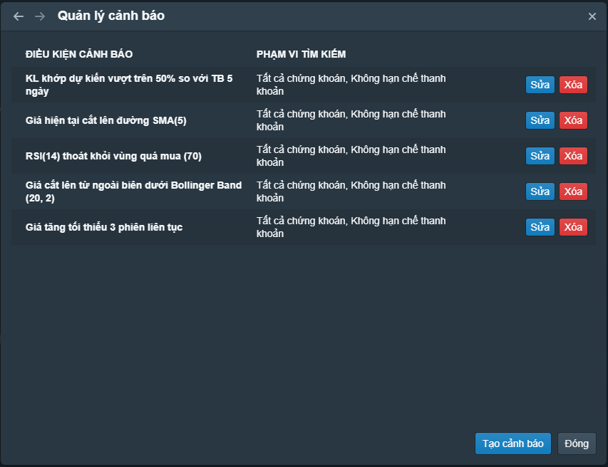

# Cảnh báo tín hiệu

Các **cảnh báo thời gian thực** dựa trên các tiêu chí mà bạn thiết lập sẽ tự động mang thông tin đến bạn khi các tiêu chí mà bạn lựa chọn được thỏa mãn.

## Tạo cảnh báo

Chức năng cảnh báo tín hiệu cho phép bạn thử nghiệm các tín hiệu trước khi tạo cảnh báo. Bạn có thể lựa chọn phối hợp các tiêu chí khác nhau và tạo ra một bộ lọc thời gian thực, kết quả lọc sẽ hiện thị phía dưới. Tiếp theo bạn có thể điều chỉnh thông số cho các tiêu chí đến khi kết quả lọc đáp ứng được nhu cầu của bạn, khi đó bạn có thể chọn đặt cảnh báo với các tiêu chí đã lựa chọn (nhấn nút **Đặt cảnh báo**)

## Quản lý cảnh báo

Sau khi tạo một số cảnh báo, bạn sẽ có nhu cầu quản lý các cảnh báo

