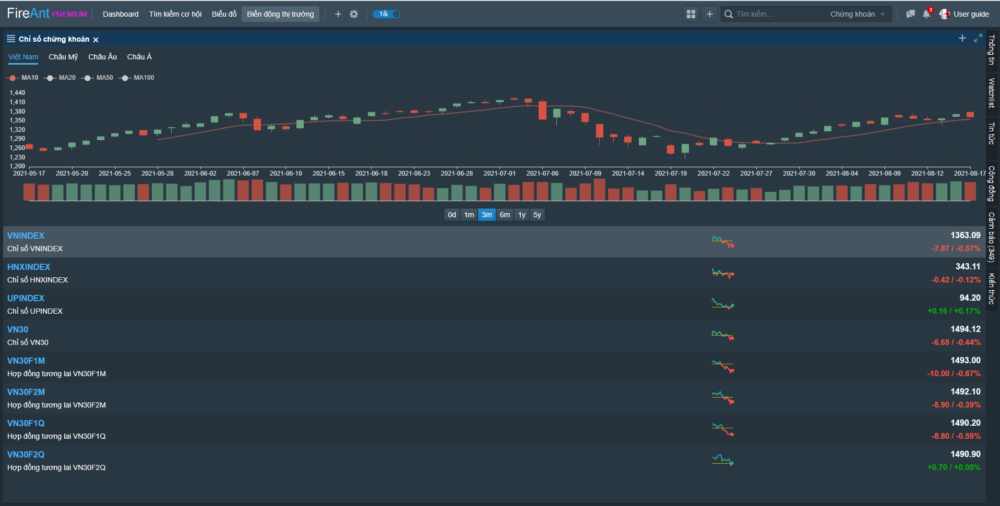
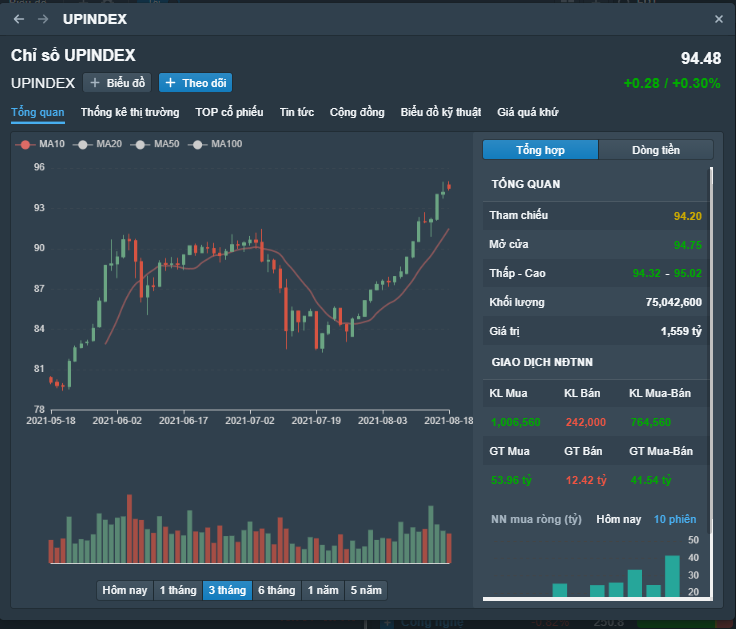

# Chỉ số chứng khoán

Chức năng **Chỉ số chứng khoán** cho phép xem nhanh thông tin các chỉ số chứng khoán của Việt Nam và thế giới. Các thông tin sau được hiển thị:

* **Biểu đồ giá và khối lượng:** Trong ngày, 1 tháng, 3 tháng, 6 tháng, 1 năm, 5 năm.
* Biến động chỉ số trong phiên cuối cùng

Nhắp chuột vào dòng chứa chỉ số để đổi sang xem chỉ số khác

Nhắp chuột vào tên chỉ số, bạn có thể xem thêm các thông tin chi tiết về chỉ số

