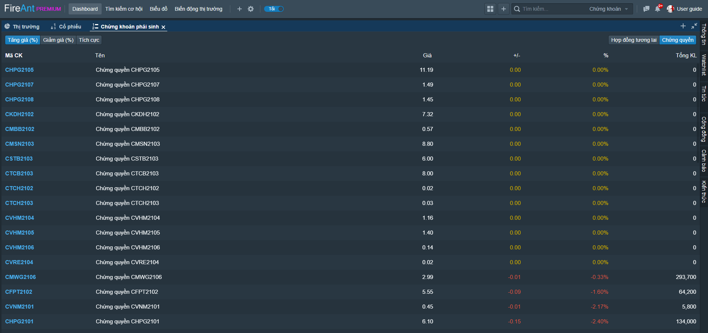

# Chứng khoán phái sinh

Chức năng chứng khoán phái sinh cung cấp các thống kê về giao dịch của các hợp đồng tương lai chỉ số VN30 và các chứng quyền có bảo đảm. Các mã chứng khoán phái sinh sẽ được sắp xếp theo các tiêu chí khác nhau, và được phân loại theo sàn giao dịch:

* Sắp xếp theo phần trăm tăng giá
* Sắp xếp theo phần trăm giảm giá
* Sắp xếp theo khối lượng giao dịch cao nhất

