# Lọc cổ phiếu thời gian thực

Lọc cổ phiếu là cách tiếp cận thông tin một cách chủ động, thông qua việc tìm kiếm các mã chứng khoán thỏa mãn các tiêu chí nhất định. Đây là cách tiếp cận truyền thống nhưng vẫn rất hiệu quả, và được phần lớn các nhà đầu tư sử dụng. Việc lọc cổ phiếu sẽ giúp bạn giảm thiểu số lượng mã mà bạn cần tập trung tìm hiểu kỹ trước khi đầu tư.

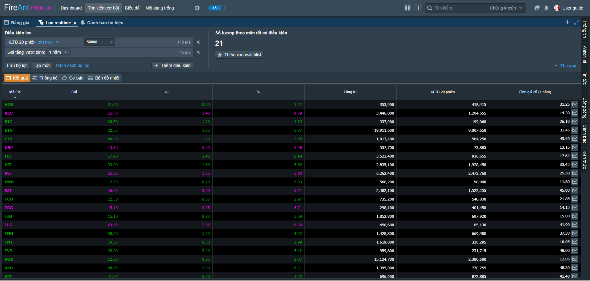

Bạn có thể thêm khối chức năng **Lọc cổ phiếu Real time** vào một bố cục bất kỳ, hoặc sử dụng bố cục **Tìm kiếm cơ hội** có sẵn khối chức năng này.&#x20;

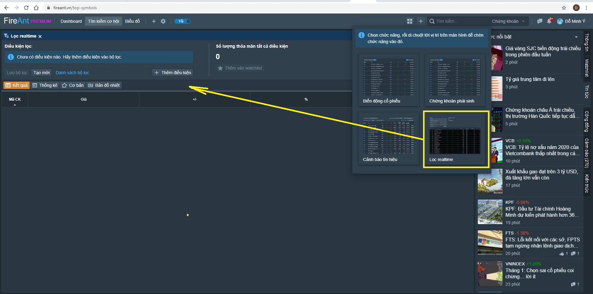

Trong hàng ngàn mã cổ phiếu đang niêm yết, để tìm ra các mã cầ thiết, thì việc chọn tiêu chí lọc là cần thiết. Sẽ khó có thể tạo một bộ lọc cho tất cả mọi người, tuy nhiên sẽ có những tiêu chí mà đa số quan tâm. Chúng ta sẽ bắt đầu bằng việc loại bỏ các mã không có thanh khoản. Nhắp chuột vào nút thêm điều kiện. Bạn sẽ thấy danh sách các điều kiện lọc có thể thêm vào. Ở nhóm tiêu chí đầu tiên, bạn có thể thêm vào tiêu chí lọc theo sàn hoặc/và theo lĩnh vực (ngành cấp 1). Nếu không sử dụng tiêu chí này này, mặc định ứng dụng sẽ lọc trong tất cả các mã của 3 sàn HSX, HNX và UpCOM.&#x20;

Ví dụ bạn hãy chọn tiêu chí Khối lượng trung bình 10 phiên (KLTB 10 phiên). Sau đó đóng dánh sách các tiêu chí lọc và chọn lơn hơn 100000 làm điều kiện lọc. Ở ví dụ dưới đây điều kiện này đã loại đi hơn 3/4 số mã của cả 3 sàn. Số mã có KLGD trung bình trên 100000CP/Phiên là 380 mã. Nếu bạn để nguyên giao diện này, có thể đến cuối phiên có thêm một số mã đạt được tiêu chí này. Việc loại bỏ các mã không có thanh khoản, thông thường sẽ là tiêu chí lọc đầu tiên. Chắc chắn bạn sẽ không muốn mất thời gian với các mã mà không thể giao dịch vì không ai giao dịch. Tuy nhu cầu từng người, bạn có thể thay đổi thông số lọc. Nếu số tiền của bạn không nhiều, thì 50000CP/phiên có lẽ là phù hợp, nhưng nếu bạn giao dịch nhiều thì cần sử dụng con số lớn hơn.

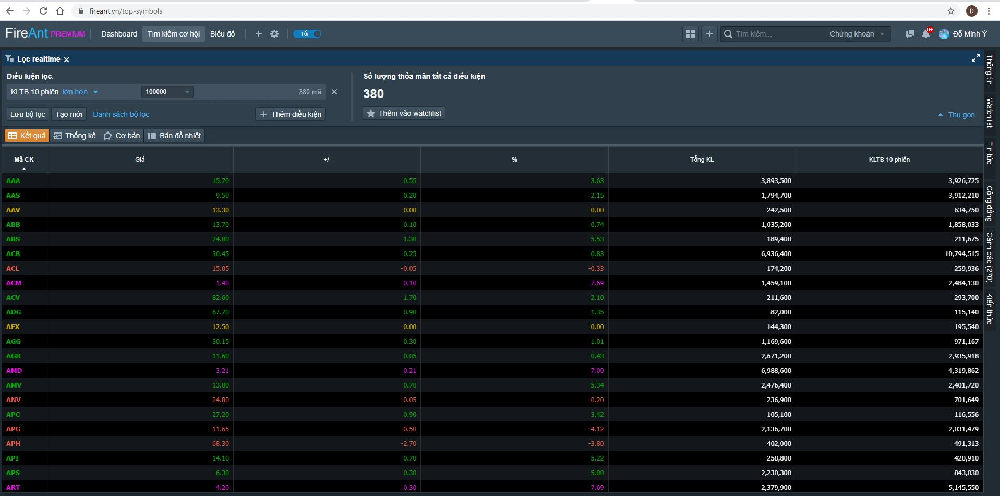

Sau khi loại các mã có thanh khoản thấp, số lượng mã vẫn còn khá nhiều, do đó chúng ta cần tiếp tục thêm vào các tiêu chí khác để tiếp tục giảm bớt số lượng mã. Ở bước này, việc chọn tiêu chí nào sẽ tùy thuộc vào cách giao dịch của bạn. Nếu bạn thích lướt sóng, bạn có thể chọn các tiêu chí ví dụ KLTB 3 tháng thấp, nhưng KLTB 5 ngày cao, các mã thỏa mãn tiêu chí này là các mã có thời gian dài ngủ đông, mà đột ngột có dòng tiền đổ vào. Ví dụ dưới đây sử dụng 3 tiêu chí

* KLTB 3 tháng dưới 50000CP/Phiên
* KLTB 10 ngày dưới 100000 CP/phiên
* KLTB 5 ngày trên 100000CP/phiên

Kết quả tìm được là 13 mã.

Bạn có thể thử nghiệm với các tiêu chí khác và thay đổi thông số cho từng tiêu chí, mỗi khi thay đổi, hệ thống sẽ liệt kê số mã đáp ứng từng tiêu chí và số mã đáp ứng tất cả các tiêu chí. Số mã tìm được sẽ được cập nhật theo thời gian thực tùy vào diễn biến giao dịch. Về nguyên tắc, bộ tiêu chí của bạn cho ra kết quả từ 5-20 mã là hợp lý. Với số lượng mã như vậy, bạn có thể bắt đầu với việc soi biểu đồ. Quá nhiều sẽ khiến bạn mất nhiều thời gian xem biểu đồ, và suy cho cùng chúng ta cũng chỉ muốn các mã phù hợp nhất, chứ không phải nhiều mã chỉ đáp ứng được vài phần yêu cầu.

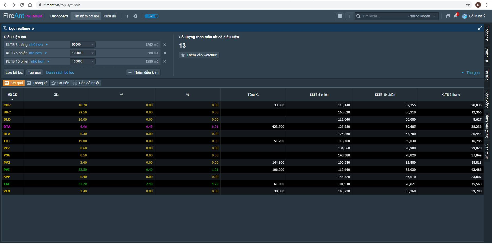

Sau khi lọc bạn có thể xem thêm các thông tin về các mã tìm được.

* **Nút Thống kê**: Thống kê về giao dịch của các mã tìm được (biến động giá 1 tuần, 1 tháng, khối lượng dự kiến trong phiên, khối lượng dự kiến so với TB 5 phiên , KL nước ngoài mua ròng/bán ròng, giá cao nhất và thấp nhất 52 tuần
* **Nút cơ bản**: Thông tin các chỉ số cơ bản của các mã tìm được (Ngành, thị giá vốn, P/E, P/S, P/B, ROA, ROE, EPS)
* **Nút Bản đồ nhiệt**: Thể hiện tương quan KLGD hiện tại giữa các mã

  Bạn cũng có thể chọn đưa các mã tìm được vào Watchlist để theo dõi tiếp (bạn chọn watchlist đã tạo hoặc đưa vào watchlist mới
* Nhắp chuột vào mã để xem hồ sơ doanh nghiệp, ngoài các thông tin chi tiết về doanh nghiệp như báo cáo tài chính, chỉ số tài chính, danh sách lãnh đạo, giao dịch cổ đông nội bộ, ... bạn có thể tìm thấy các tin tức liên quan, cũng như các chia sẻ của cộng đồng liên quan đến mã cổ phiếu tương ứng.

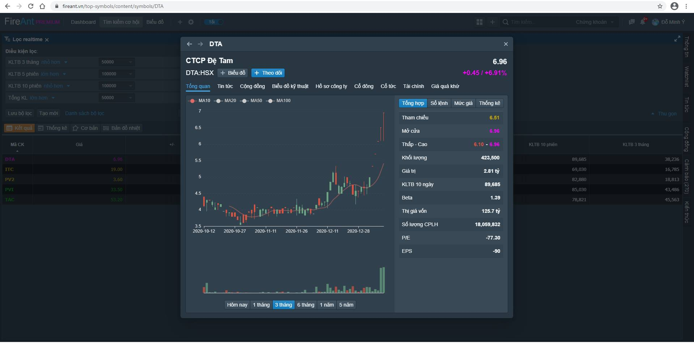

## Các điều kiện lọc&#x20;

**Lọc theo sàn và lĩnh vực:** Khi chọn tiêu chí này bạn có thế hạn chế việc thực hiện lọc với các mã của từng sàn hoặc từng lĩnh vực.&#x20;

**Lọc theo Thông tin cổ đông**: Thành phần cổ đông của doanh nghiệp, đặc biệt là nhóm cổ đông tổ chức, cổ đông là ban lãnh đạo. Nhóm này có các tiêu chí lọc sau:

* Tỷ lệ sở hữu của ban lãnh đạo
* Tỷ lệ sở hữu của Tổ chức
* Tỷ lệ sở hữu của Tổ chức nước ngoài
* Số lượng cổ đông là Tổ chức
* Số lượng cổ đông là Tổ chức nước ngoài

Nếu các tổ chức và ban lãnh đạo sở hữu quá nhiều, sẽ dẫn đến mất thanh khoản, nhưng nếu một doanh nghiệp không có cổ đông tổ chức hoặc ban lãnh đạo không nắm giữ cổ phiếu, thì thường là doanh nghiệp chất lượng kém.

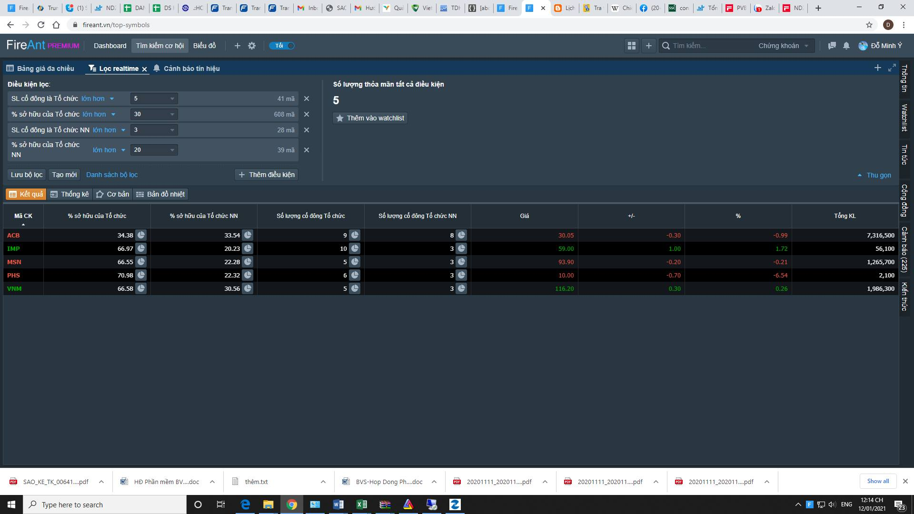

**Lọc theo tiêu chí Thống kê giá:** Các bạn có thể chọn các tiêu chí lọc biến động giá trong các khoảng thời gian (phiên hiện tại, 1 tuần, 1 tháng, 3 tháng, 6 tháng, 1 năm), hoặc tổ hợp các tiêu chí này và chuẩn hóa về thang 100 so sánh giữa các mã với chỉ số RS (sức mạnh giá tương đối). Chẳng hạn bạn có thể tìm các mã chưa biến động nhiều trong khoảng thời gian dài (ví dụ biến động thấp hơn 5% trong 3 tháng), nhưng lại biến động mạnh trong thời gian gần đây (nhiều hơn 10% trong tuần cuối), nhiều khả năng đây là các mã sắp hoặc vừa phá nền giá Các bạn cũng có tìm kiếm theo các tiêu chí giá khác nhau như:

* Các mã tăng vượt qua các đỉnh (đỉnh tuần, tháng , ...) hoặc giảm thủng đáy (tuần, tháng, ...).
* Các mã tăng liên tiếp hoặc giảm liên tiếp nhiều phiên
* Các mã có chuỗi tăng hoặc giảm và đảo chiều phiên hiện tại
* Các mã có giá hiện tại tăng vượt hoặc giảm quá 1 ngưỡng
* Các mã biến động mạnh hơn hay kém index (sử dụng chỉ số beta 6 tháng)

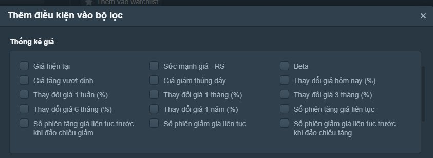

**Lọc theo các tiêu chí KLGD**: Các tiêu chí về KLGD có thể được sử dụng để loại bỏ các mã có thanh khoản thấp. Ví dụ bạn có thể lựa chọn loại bỏ các mã có KLGD trong phiên hay KLTB 5 phiên (tương đương 1 tuần), 10 phiên (tương đương 2 tuần), 20 phiên (tương đương 1 tháng), hay 3 tháng thấp hơn một khối lượng nhất định. Bạn cũng có thể lọc các mã theo khối lượng mua bán ròng của nđt nước ngoài hoặc lọc theo tỷ trọng giữa KL mua chủ động và bán chủ động.&#x20;

**Lọc theo Tín hiệu đường trung bình**: Đường trung bình được sử dụng để xác định mã đang nằm trong xu hướng nào. Điểm giao cắt giữa đường giá và các đường trung bình SMA, EMA cũng như điểm giao cắt giữa các đường trung bình ngắn và dài hạn thường được sử dụng để xác nhận sự đảo chiều xu hướng. Các điểm này cũng có thể được sử dụng như các tín hiệu gợi ý mua bán.&#x20;

Tín hiệu gợi ý mua

* Đường giá cắt lên SMA hoặc EMA
* Đường MA ngắn hạn cắt lên đường MA dài hạn&#x20;

Tín hiệu gợi ý bán

* Đường giá cắt xuống SMA hoặc EMA
* Đường MA ngắn hạn cắt xuống đường MA dài hạn

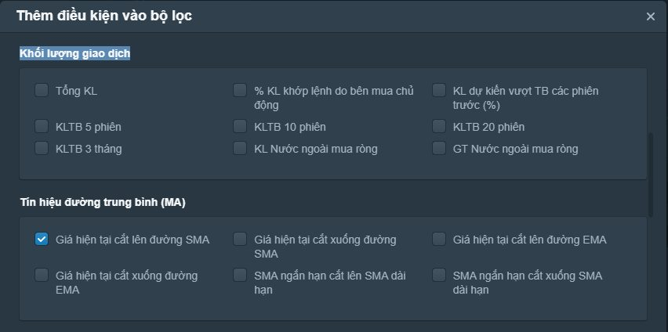

**Lọc theo các tiêu chí kỹ thuật**: Các tiêu chí kỹ thuật cho phép chúng ta lọc ra các mã thỏa mãn các tín hiệu kỹ thuật (chỉ số cắt đường tín hiệu, đi vào, thoát ra vùng quá mua, quá bán, ... hoặc các mã đang nằm trong các vùng quá mua, quá bán, ... Các tiêu chí kỹ thuật hiện có 4 loại&#x20;

**Các tiêu chí liên quan đến chỉ số RSI** (Chỉ số sức mạnh tương đối) cho phép lọc ra các mã mà:

* RSI đi vào vùng quá mua, quá bán
* RSI đi ra khỏi vùng quá mua, quá bán
* RSI nằm trong vùng quá mua, quá bán

**Các tiêu chí liên quan đến chỉ số MFI** (Chỉ số dòng tiền) cho phép lọc ra các mã mà:

* MFI đi vào vùng quá mua, quá bán
* MFI đi ra khỏi vùng quá mua, quá bán
* MFI nằm trong vùng quá mua, quá bán

Các bạn có thể thiết lập giá trị ngưỡng cho các vùng quá mua/ quá bán. Với RSI vùng quá mua mặc định là trên 70, vùng quá bán mặc định là dưới 30. Với MFI vùng quá mua mặc định là trên 80, vùng quá bán mặc định là dưới 20 (tùy từng thời điểm của thị trường các bạn có thể thay đổi các giá trị này).

Thông thường gợi ý mua sẽ có khi RSI hoặc MFI thoát ra khỏi vùng quá bán. Ngược lại gợi ý bán sẽ tương ứng với RSI hoặc MFI thoát khỏi vùng quá mua.

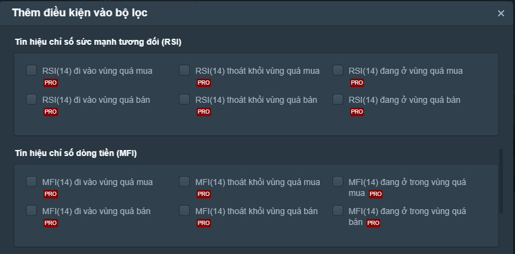

**Các tiêu chí liên quan đến Bollinger Bands** cho phép lọc ra các mã:

* Giá thoát xuống dưới biên dưới hoặc vượt lên trên biên trên
* Giá quay trở lại bên trong hai dải BB từ dưới hoặc từ trên
* Giá nằm dưới biên dưới hoặc nằm trên biên trên

  Tín hiệu gợi ý mua ứng với điều kiện
* Giá quay lại bên trong 2 dải BB từ dưới

  Tín hiệu gợi ý bán ứng với điều kiện
* Giá quay lại bên trong 2 dải BB từ trên

**Các tiêu chí liên quan đến chỉ số MACD** cho phép lọc ra các mã:

* MACD cắt lên hoặc cắt xuống đường in hiệu
* MACD cắt lên hoặc cắt xuống đường 0
* MACD nằm trên hoặc nằm dưới đường 0
* MACD nằm trên hoặc dưới đường tín hiệu

  Thông thường chúng ta sẽ chọn các điều kiện gợi ý mua như sau
* MACD cắt lên đường tín hiệu
* MACD cắt lên đường 0

  tương tự điều kiện gợi ý bán sẽ là
* MACD cắt xuống đường tín hiệu
* MACD cắt xuống đường 0

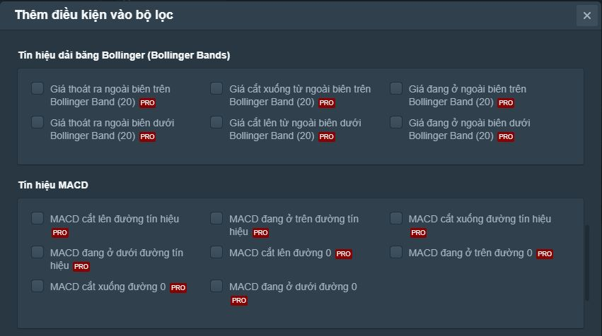

**Lọc theo các chỉ số tài chính:** Các chỉ số tài chính được chia làm các nhóm&#x20;

**Các chỉ số dựa trên kết quả kinh doanh:** Nếu bạn định đầu tư vào các doanh nghiệp tăng trưởng, bạn sẽ cần lọc theo các chỉ tiêu về kết quả kinh doanh. Trong trường hợp này, doanh nghiệp cần thể hiện có doanh thu và lợi nhận cao và có sự gia tăng về doanh thu cũng như lợi nhuận, bạn có thể sử dụng các tiêu chí tăng trưởng cho bộ lọc.&#x20;

Nếu bạn định đầu tư vào các doanh nghiệp kinh doanh ổn định, bạn nên thêm tiêu chí cổ tức bằng tiền. Trong đa số các trường hợp, doanh nghiệp cần làm ăn có lãi, do đó hãy loại các doanh nghiệp có lợi nhuận âm. Bạn cũng có thể chấp nhận lợi nhuận âm, với điều kiện doanh nghiệp đang đầu tư rất lớn để mở rộng sản xuất, tuy nhiên lợi nhuận âm kéo dài nhiều quý sẽ khiến dòng tiền của doanh nghiệp có vấn đề, nợ sẽ tăng cao và tạo áp lực tài chính lên kết quả kinh doanh.&#x20;

**Các chỉ số định giá:** Các chỉ tiêu trong nhóm nay giúp bạn so sánh giá trị cổ phiếu giữa các doanh nghiệp, đặc biệt các doanh nghiệp cùng ngành.&#x20;

Do các doanh nghiệp có quy mô khác nhau, số lượng CP lưu hành khác nhau, và bạn cũng chỉ sở hữu một số cỏ phiếu, nên lợi nhuận trên mỗi cổ phiếu đối với bạn sẽ quan trọng hơn so với tổng lợi nhuận của doanh nghiệp Các chỉ số EPS, P/E, P/B, P/S khi so sánh giữa các doanh nghiệp cùng ngành sẽ giúp bạn xác định doanh nghiệp nào đang dẫn đầu&#x20;

**Các chỉ số về khả năng sinh lợi**: Khả năng sinh lợi được tính bằng tỷ lệ giữa lợi nhuận và doanh thu. Doanh thu cao nhưng tỷ lệ lợi nhuận thấp thường thấy ở các doanh nghiệp thương mại do giá vốn hàng bán cao. Các doanh nghiệp sản xuất tốt, trái lại cần có khả năng sinh lợi cao.&#x20;

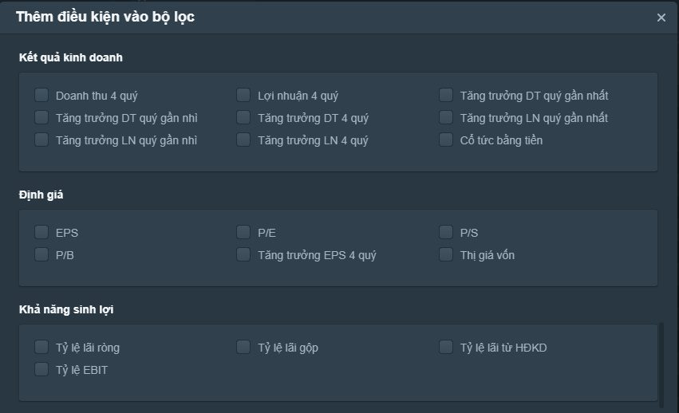

**Các chỉ số về sức mạnh tài chính**: Sức mạnh tài chính thể hiện khả năng thanh toán các khoản nợ cũng như tỷ lệ nợ trên vốn, trên tài sản của doanh nghiệp.&#x20;

Bạn nên tránh các doanh nghiệp có tỷ lệ nơ cao và khả năng thanh toán thấp. Các doanh nghiệp có tỷ lệ nợ thấp, khả năng thanh khoản cao, là các doanh nghiệp rất đáng để xem xét đầu tư, tuy nhiên bạn cũng cần để ý xem doanh nghiệp đang kinh doanh như thế nào, vì một doanh nghiệp có tài chính dồi dào, nhưng không mở rộng sản xuất kinh doanh, cũng không trả cổ tức,thì chắc chắn có vấn đề về tính minh bạch.&#x20;

**Các chỉ số về hiệu quả quản lý**: Hiệu quả quản lý thể hiện bằng tỷ lệ giữa lợi nhuận và vốn (hoặc tài sản). Việc sử dụng vốn hiệu quả tạo ra lợi nhuận cao chứng tỏ doanh nghiệp kinh doanh tốt, tạo ra nhiều lợi nhuận với chi phí hợp lý. Những doanh nghiệp có hiệu quả quản lý tốt rất đáng để đầu tư. Bạn cũng cần chú ý theo dõi các hệ số này trong giai đoạn đủ dài, để tránh các trường hợp lợi nhuận bất thường chỉ được tạo ra trong 1 hoặc 2 quý.&#x20;

**Các chỉ số về khả năng hoạt động**: Khả năng hoạt động thể hiện bới các vòng quay tài sản, hàng tồn kho, khoản phải thu, ... doanh nghiệp có khả năng quay vòng vốn nhanh là luôn các doanh nghiệp năng động và sử dụng vốn hiệu quả.

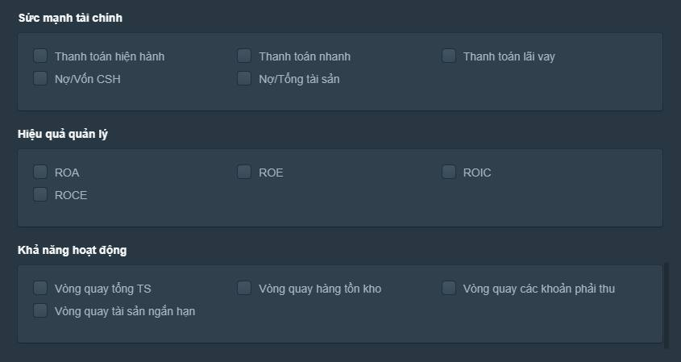
