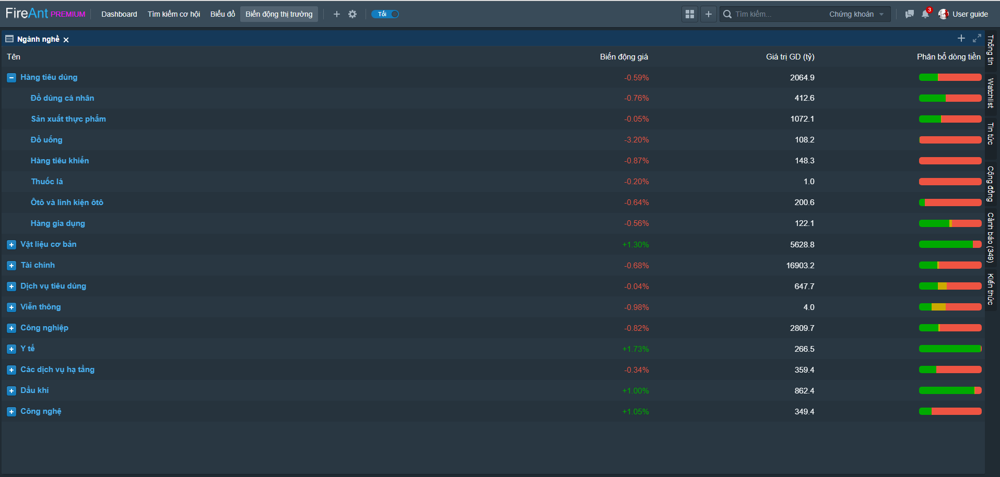
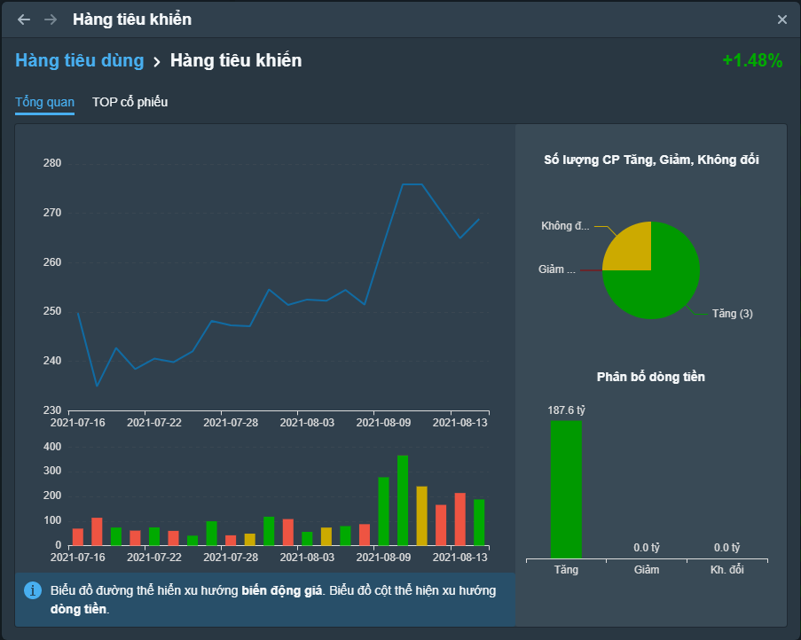
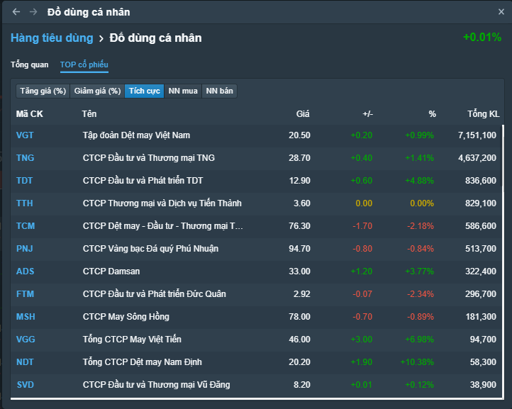

# Ngành nghề

Chức năng ngành nghề cho phép xem nhanh biến động chỉ số index ngành (được tính tương tự VNINDEX), giá trị giao dịch trên mỗi ngành, cũng như phân bổ dòng tiền trên mỗi ngành (theo số tiền chảy vào các mã tăng, giảm, và không thay đổi giá).

Ngành được sử dụng là các ngành cấp 1 và cấp 3 theo chuẩn phân ngành ICB

Nhắp chuột vào tên ngành, bạn sẽ truy cập được thông tin chi tiết về ngành:

* Thông tin tổng quan: Đồ thị index ngành cùng giá trị giao dịch các phiên trong vòng 1 tháng gần nhất, biểu đồ phân bổ dòng tiền và biểu đồ số mã tăng giảm, không thay đổi giá trong phiên.

* TOP cổ phiếu trong ngành: được sắp xếp theo các tiêu chí khác nhau
  * Theo % tăng giá
  * Theo % giảm giá
  * Theo khối lượng giao dịch
  * Theo giá trị giao dịch mua của khối ngoại
  * Theo giá trị giao dịch bán của khối ngoại

