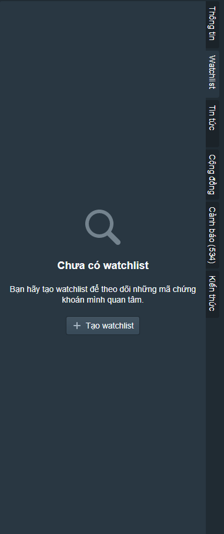
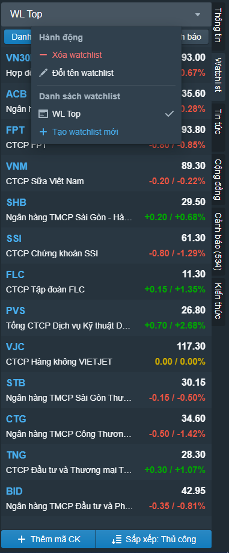
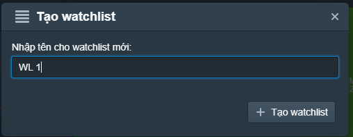
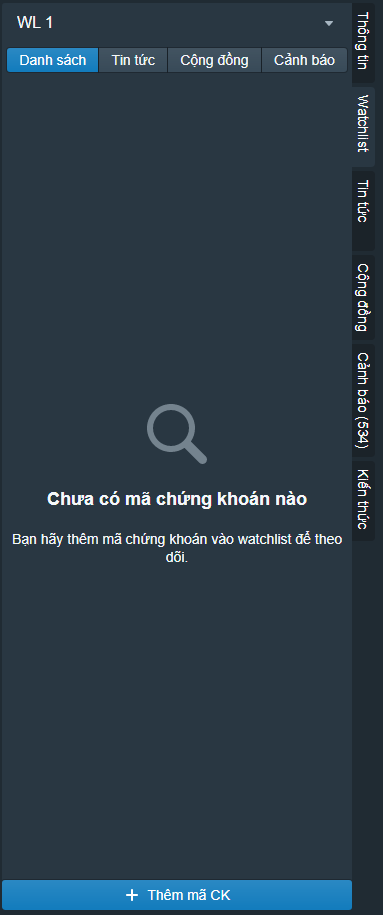
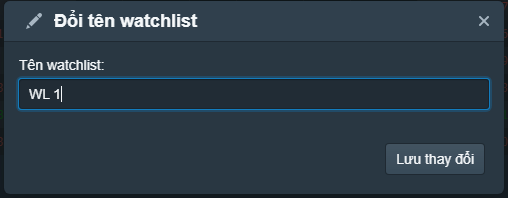
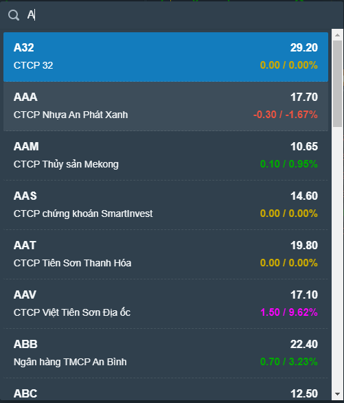
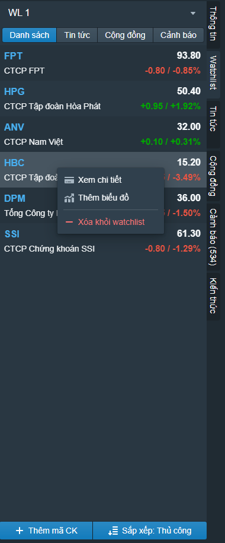
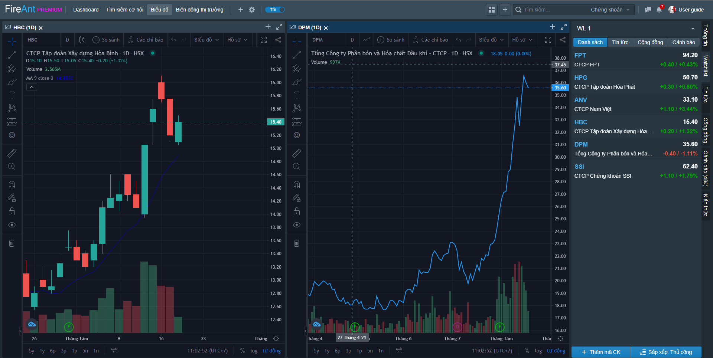
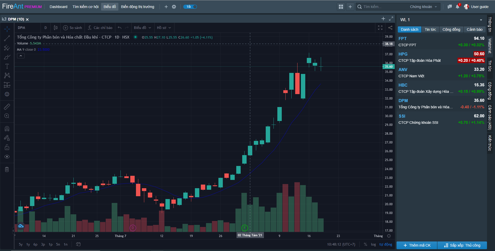

# Tạo và sử dụng Watchlist

## **Tạo Watchlist**

Để tạo **Watchlist**, vào mục **Watchlist** (menu dọc phía phải màn hình)**,** bấm nút **Tạo Watchlist,**&#x20;

|  |  |
| ------------------------------------------------------------------- | ------------------------------------------------------------------- |
| Tạo Watchlist đầu tiên                                              | Tạo thêm Watchlist mới                                              |

Đặt tên cho **Watchlist**, bấm nút **Tạo Watchlist**

Sau khi tạo Watchlist bạn có thể thêm các mã vào **Watchlist**

Bạn cũng có thể tạo Watchlist theo một số cách khác:

* Từ [**Bảng giá**](https://app.gitbook.com/@fireant/s/fireant-for-web/~/drafts/-MhIomdcWrenzVG5swKu/tim-kiem-co-hoi/bang-gia)
* Từ chức năng [**Thông tin cổ phiếu**](https://app.gitbook.com/@fireant/s/fireant-for-web/~/drafts/-MhIomdcWrenzVG5swKu/thong-tin-co-phieu/truy-cap-thong-tin-co-phieu)
* Từ kết quả [**Lọc cổ phiếu**](https://app.gitbook.com/@fireant/s/fireant-for-web/~/drafts/-MhIomdcWrenzVG5swKu/tim-kiem-co-hoi/loc-co-phieu-thoi-gian-thuc)

## Các thao tác trên Watchlist

Khi Watchlist của bạn có một số lượng mã nhất định, bạn có thể thực hiện các thao tác:

* Đổi tên Watchlist
* Thêm mã mới vào Watchlist
* Xóa mã khỏi Watchlist
* Sắp xếp mã
* Tạo biểu đồ từ mã trong Watchlist

**Đổi tên Watchlist**

Để đổi tên **Watchlist**, chọn Watchlist trong danh sách **Watchlists,** bấm nút **Đổi tên Watchlist,**  đặt một tên khác cho Watchlist và bấm **Lưu thay đổi.**

**Thêm mã vào Watchlist**

Để thêm mã vào **Watchlist**, bấm nút **Thêm mã CK.** Gõ mã chứng khoán bạn muốn thêm và nhắp chuột vào mã muốn thêm.

**Xóa mã khỏi Watchlist**

Để xóa mã khỏi **Watchlist**, di chuột qua dòng chứa mã chứng khoán trong **Watchlist**, chuột phải và chọn **Xóa khỏi Watchlist.**

#### **Xóa Watchlist**

Để xóa **Watchlist**, vào mục **Watchlist**, chọn một **Watchlist** trong số các **Watchlist** mà bạn đã tạo, bấm nút **Xóa** **Watchlist, Watchlist** tương ứng sẽ được xóa khỏi danh sách các **Watchlists**.


**Lưu ý**: Khi xóa một **Watchlist***,* **Watchlist** sẽ bị xóa ngay dù có đang chứa các mã hay không.


**Tạo biểu đồ mới từ mã trong Watchlist**

Để tạo biểu đồ mới từ mã trong **Watchlist**, chuột phải lên dòng chứa mã và chọn **Thêm biểu đồ**, kéo thả biểu đồ lên trang thông tin. Bạn sẽ có hai lựa chọn:

* Gắn biểu đồ thành tab trên một cửa sổ có sẵn
* Gắn biểu đồ thành một cửa sổ mới của Trang thông tin


**Lưu ý**: Khi thêm biểu đồ mới từ các mã trong Watchlist, biểu đồ sẽ mặc định là dạng đường (line)


## **Sử dụng Watchlist**

**Watchlist** được sử dụng để lưu trữ và theo dõi các mã mà bạn quan tâm. Có hai hình thức sử dụng **Watchlist**: gián tiếp và trực tiếp.

**Sử dụng gián tiếp**

* **Watchlist** được sử dụng để tạo bảng giá: Các mã trong một **Watchlist** sẽ tạo thành các mã trên [**Bảng giá**](https://help.fireant.vn/fireant-for-web/tim-kiem-co-hoi/bang-gia)
* **Watchlist** được sử dụng làm [đối tượng cảnh báo](https://help.fireant.vn/fireant-for-web/tim-kiem-co-hoi/canh-bao)
* **Watchlist** được sử dụng chung giữa **FireAnt for Web** và [**FireAnt for Mobile**](https://help.fireant.vn/fireant-for-mobile/)

**Sử dụng trực tiếp**

**Watchlist** cũng có thể được sử dụng trực tiếp trong chức năng **Watchlist** để theo dõi các mã. Một trong những cách sử dụng phổ biến nhất là dùng để theo dõi (tracking) biểu đồ các mã cổ phiếu bằng cách lần lượt nhắp chuột vào dòng chứa mã trong Watchlist, biểu đồ của mã tương ứng sẽ hiện thị.


**Lưu ý**: Khi bấm chuột vào tên mã trong **Watchlist**, bạn sẽ truy cập vào thông tin cổ phiếu thay vì biểu đồ

