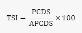

# True Strength Index

1. **Mục đích của TSI**:
   * TSI giúp các nhà giao dịch:
     * Xác định xu hướng thị trường và khả năng đảo chiều.
     * Xác định trạng thái quá mua và quá bán.
     * Hiển thị sự thay đổi xu hướng tiềm năng thông qua việc thoát khỏi vùng quá mua/quá bán hoặc đường tín hiệu.
     * Cảnh báo về sự suy giảm của xu hướng thông qua hiện tượng **phân kỳ**.
2. **Công thức tính toán TSI**:
   * TSI được tính bằng các bước sau:
     * Tính thay đổi giá **(PC)**: Trừ giá đóng cửa trước đó từ giá đóng cửa hiện tại.
     * Làm mượt thay đổi giá **(PCS)**: Áp dụng EMA 25 chu kỳ cho **PC**.
     * Làm mượt lần hai **(PCDS)**: Áp dụng EMA 13 chu kỳ cho **PCS**.
     * Tính trị tuyệt đối của PC **(APC)**: Lấy giá trị tuyệt đối của **PC**.
     * Làm mượt APC **(APCS)**: Áp dụng EMA 25 chu kỳ cho **APC**.
     * Làm mượt lần hai **(APCDS)**: Áp dụng EMA 13 chu kỳ cho **APCS**.
     * Cuối cùng, tính giá trị TSI bằng công thức:

       <figure><figcaption></figcaption></figure>
3. **Phân tích**:
   * TSI dao động giữa vùng dương (bullish) và vùng âm (bearish).
   * Sự **phân kỳ** giữa TSI và giá có thể báo hiệu xu hướng giá đang yếu đi và có thể đảo chiều.
   * Khi TSI cắt lên trên đường tín hiệu, đó có thể là tín hiệu mua; khi cắt xuống dưới, đó có thể là tín hiệu bán.
   * Mức quá mua và quá bán sẽ thay đổi tùy thuộc vào tài sản được giao dịch.


TSI cung cấp thông tin về sức mạnh của xu hướng và khả năng đảo chiều, giúp các nhà giao dịch đưa ra quyết định thông thái trong thị trường đang biến động.

